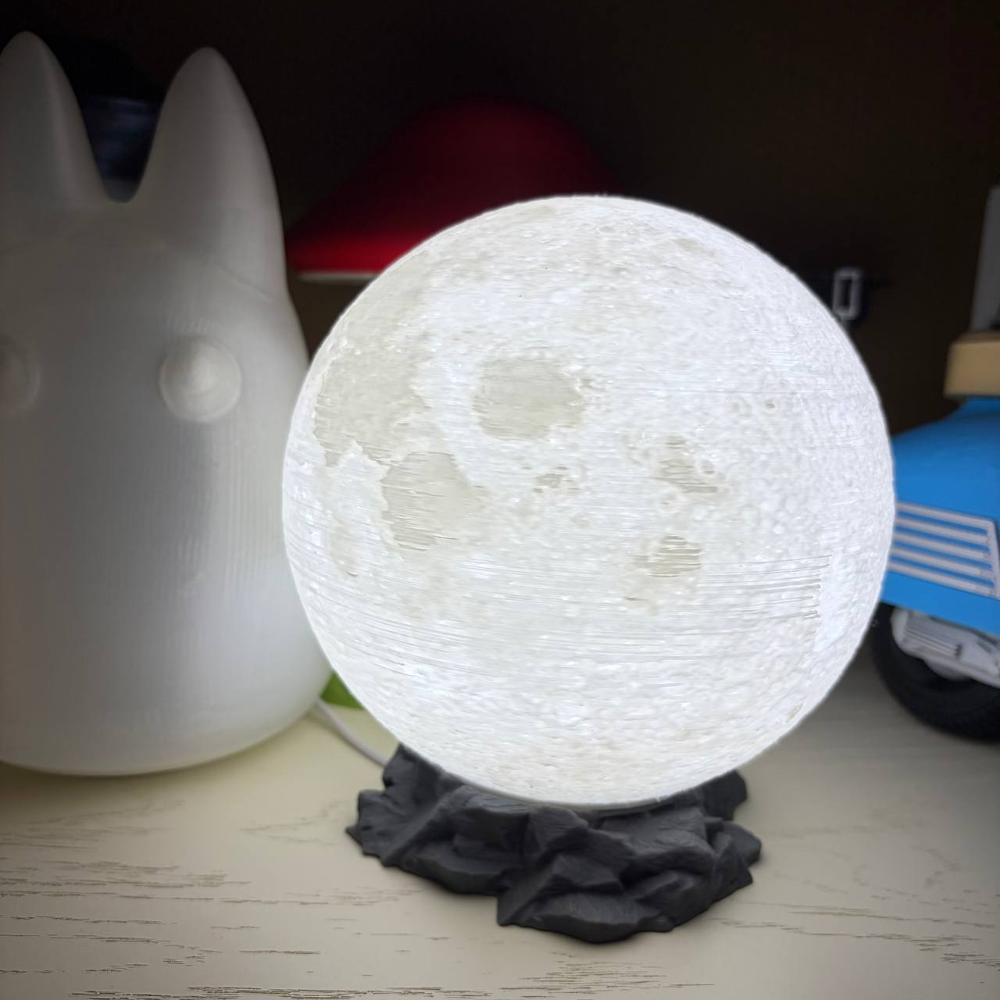
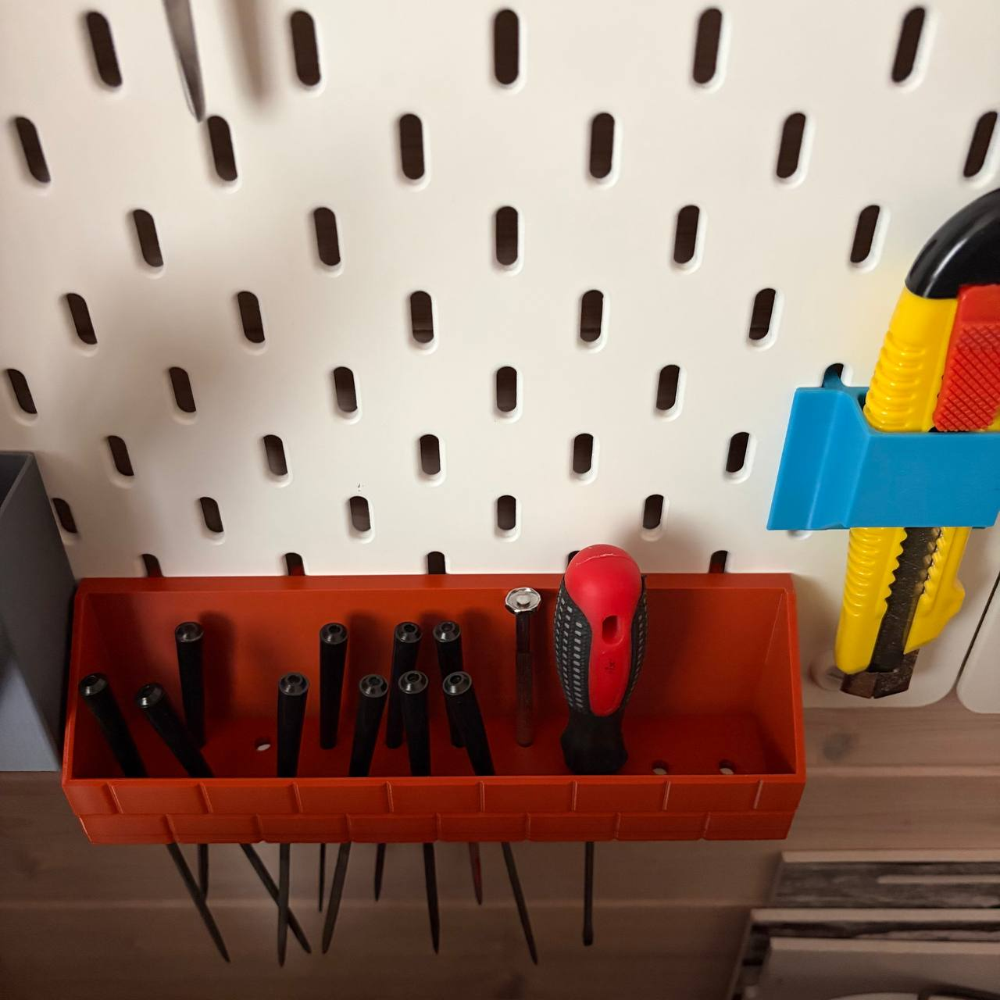
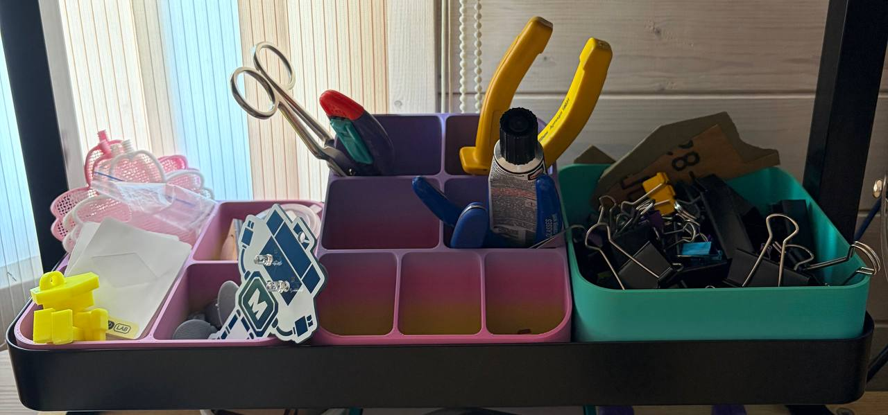
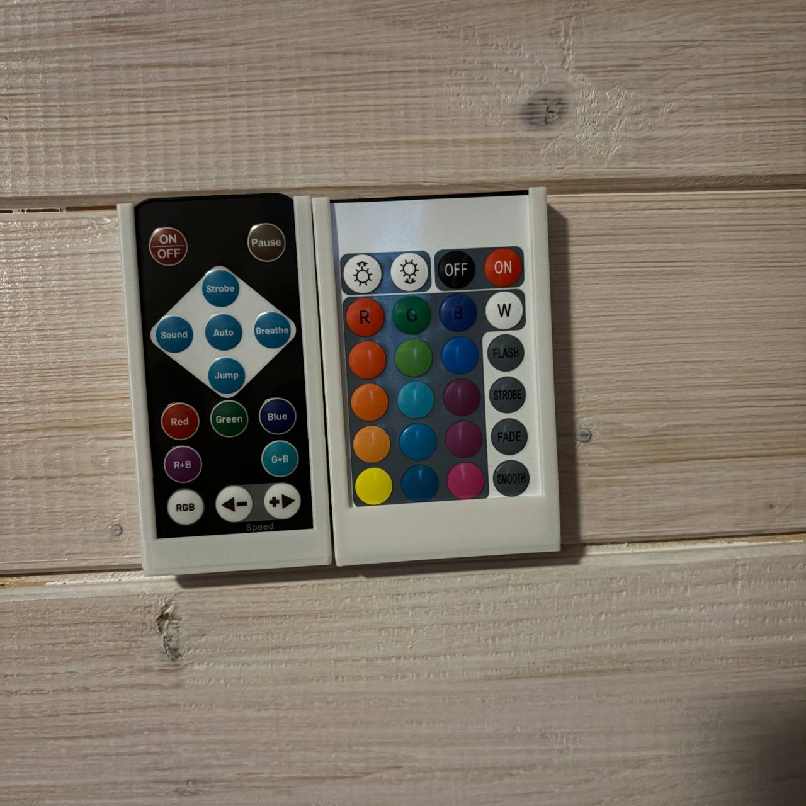
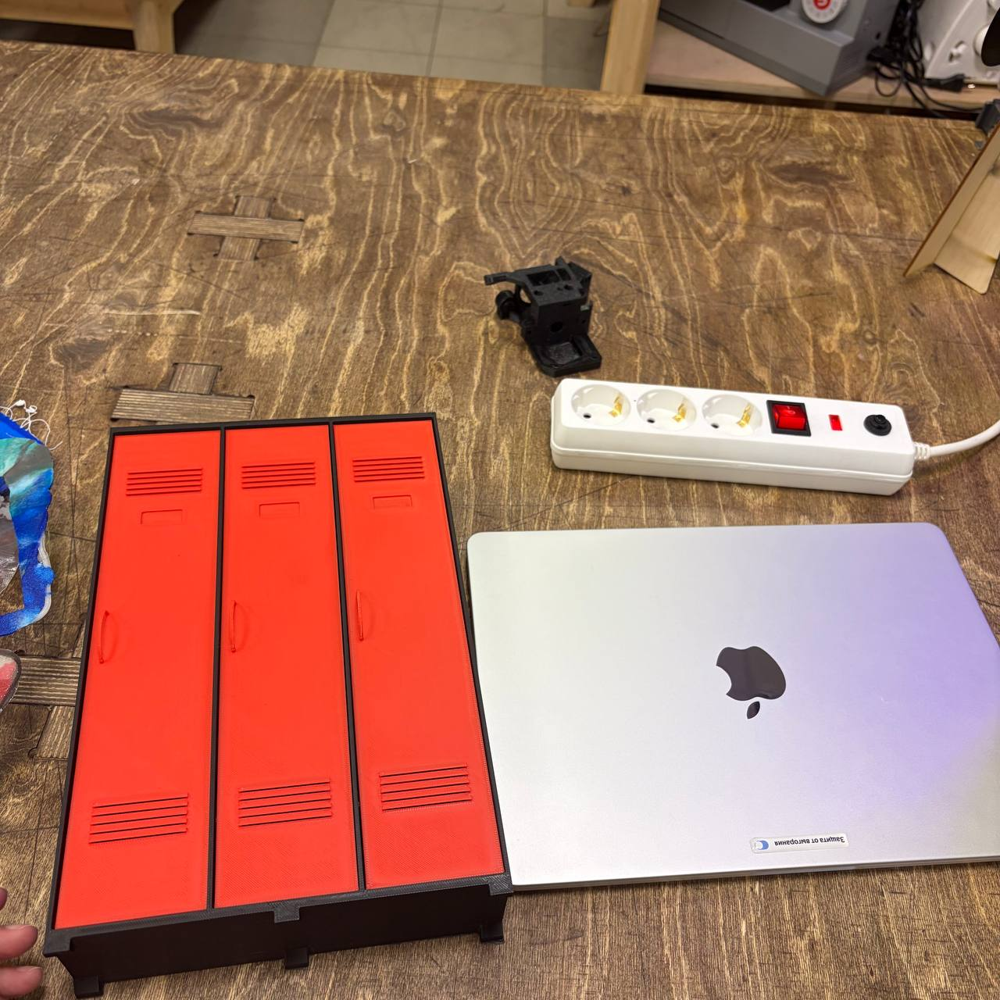

# CoLab
 
Яндекс подружился с Университетом науки и технологий МИСИС и нам выпал отличный шанс походить в фанлабу поучиться полезному и поделать прекрасное (или не очень - как получится). 
Обстановка там очень творческая, а мастера всегда готовы рассказать много полезного и подсказать что и как лучше сделать. 
<table>
  <tr>
    <td></td>
    <td></td>
  </tr>
  <tr>
    <td></td>
    <td></td>
  </tr>
</table>

# 28 июня
<b><a href = "./crocs/README.md">Мини кроксы</a></b> 
  
  
<b><a href = "./thermoformed_sakura_flowers/README.md">Термоформованная коробочка-сакура</a></b> 
  
 

# 3 и 18 июля
<b><a href = "./mini_vintage_scooter/README.md">Винтажный мини скутер</a></b> 
  
 

# 19 июля
<b><a href = "./power_strip_mount/README.md">Крепление для сетевого фильтра</a></b> 
  
  
<b><a href = "./moon_lamp/README.md">Лунолампа</a></b> 
  
 

# 25 июля
<b><a href = "./needle_file_holder/README.md">Держатель для надфилей</a></b> 
  
 

# 26 июля
<b><a href = "./vattenkar_trays/README.md">Вставки для полки Ikea Vattenkar</a></b> 
  
 

# 1 августа
<b><a href = "./bts_clip/README.md">Закладка для книг в виде скрепки</a></b> 
<b><a href = "./remote_holders/README.md">Держатели для пультов</a></b> 
  
 

# 2 августа
Поддержка для Sunlu Filament Connector (TODO)

# 15 и 16 августа
<b><a href = "./termotransfer/README.md">Термотрансфер</a></b> 
  

# 21-23 августа
<b><a href = "./mini_locker/README.md">Мини локер</a></b> 
  

# 28 августа
<b><a href = "./disco_lights/README.md">Мини "цветомузыка"</a></b> 
Зеркало Еиналеж (TODO) 

# 30 августа
Мини стол в стиле LEGO (TODO)
