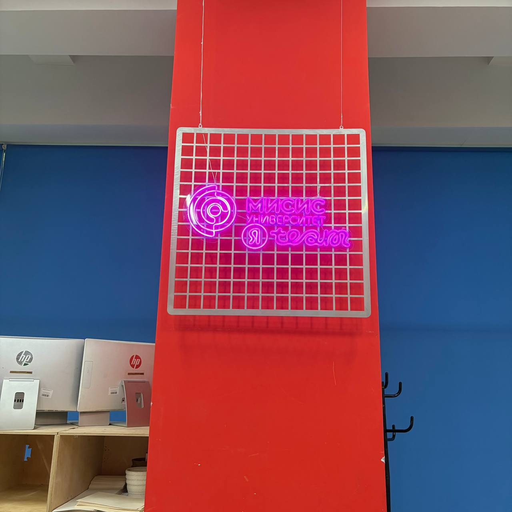
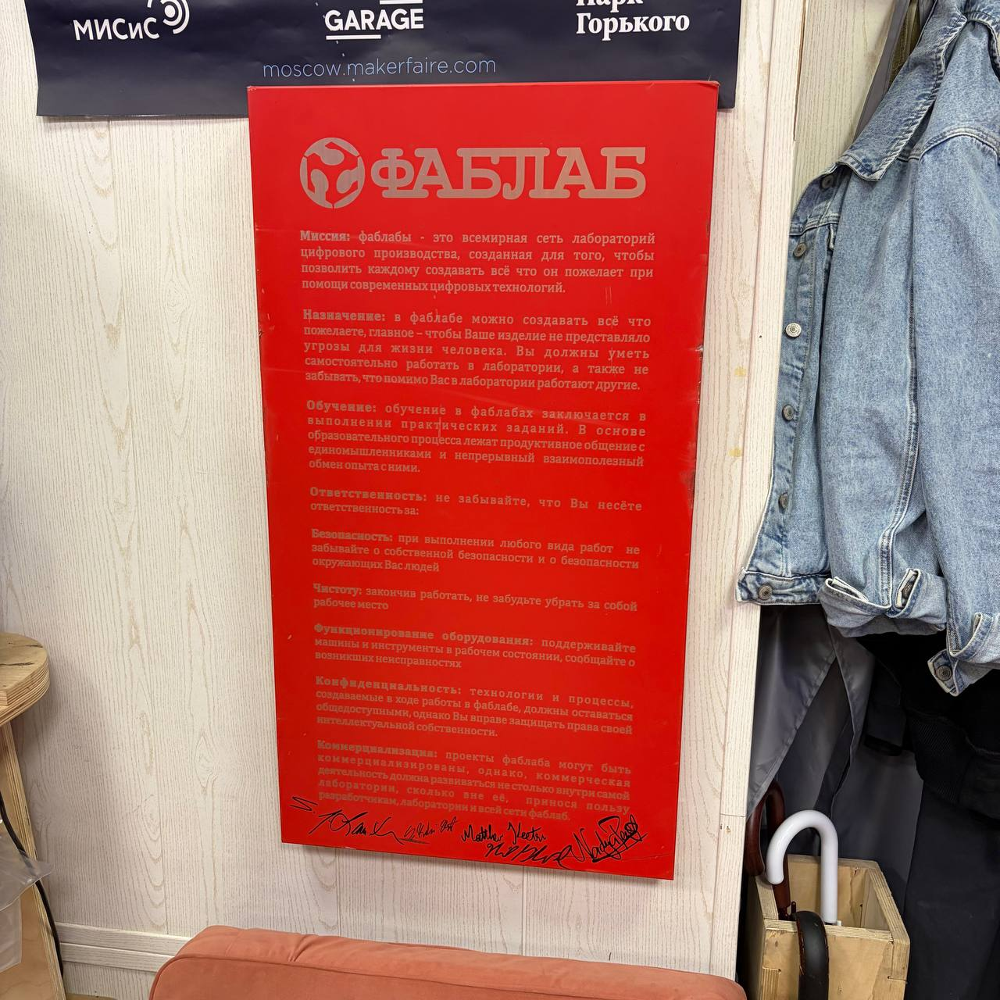
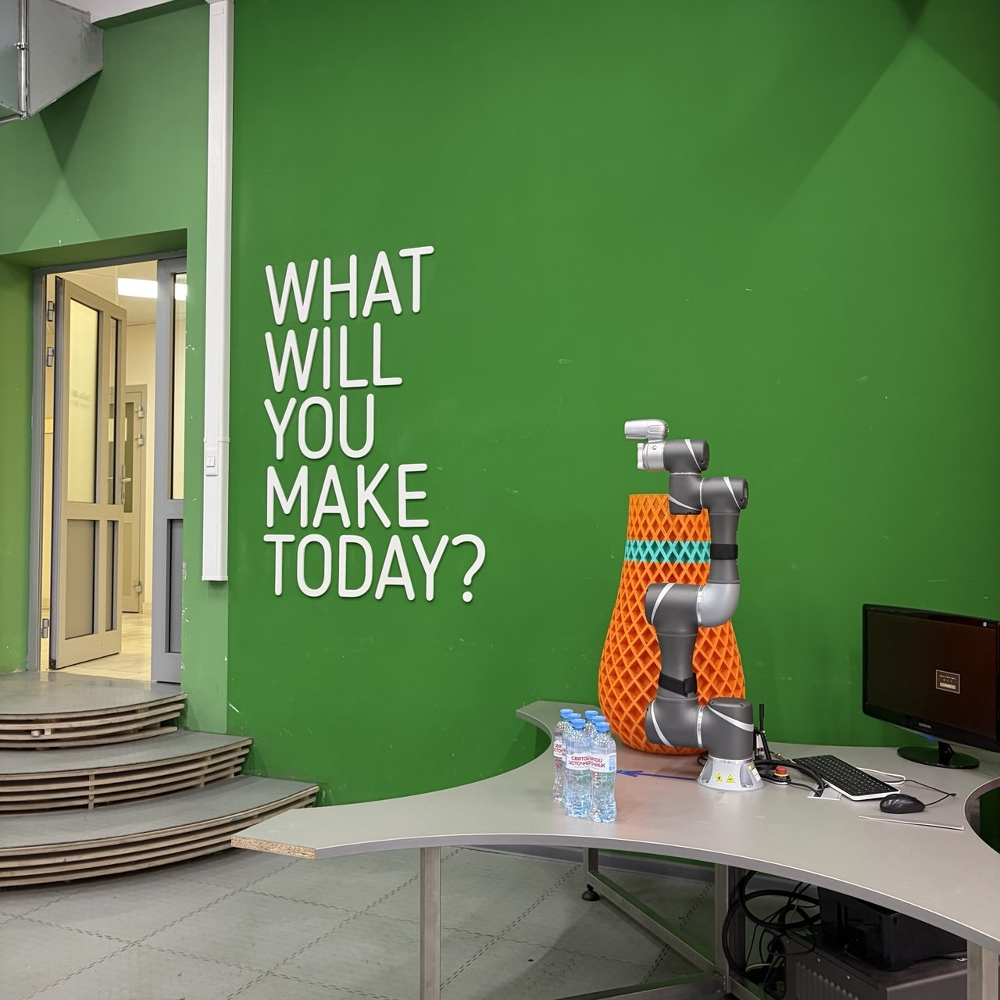
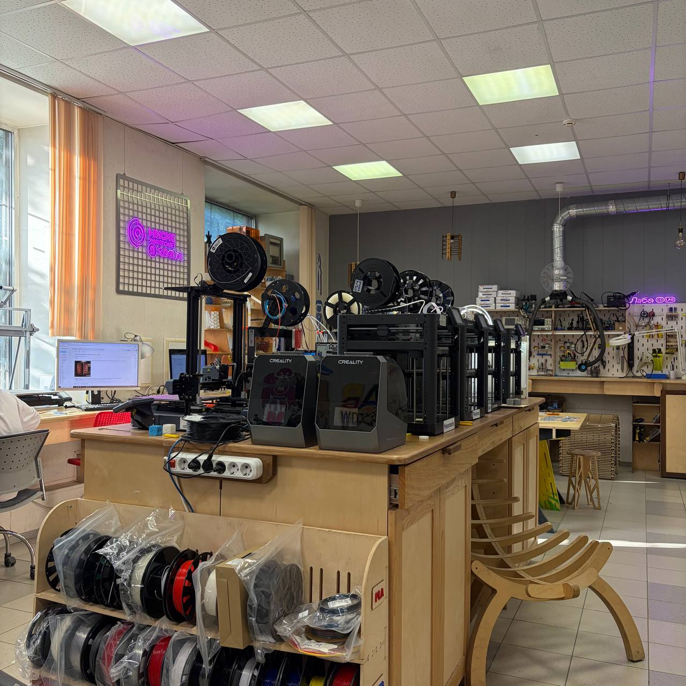
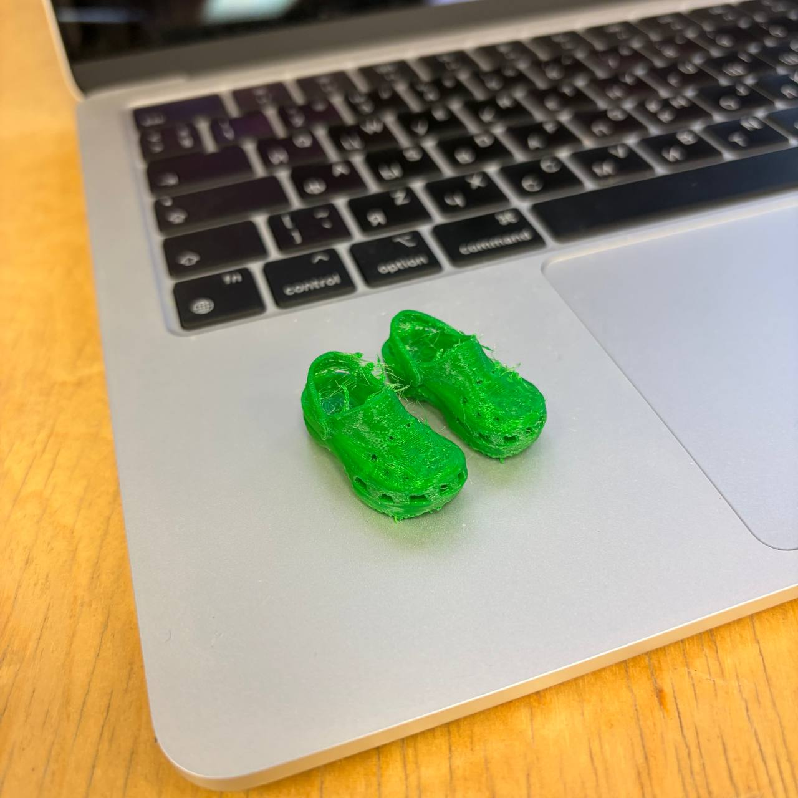
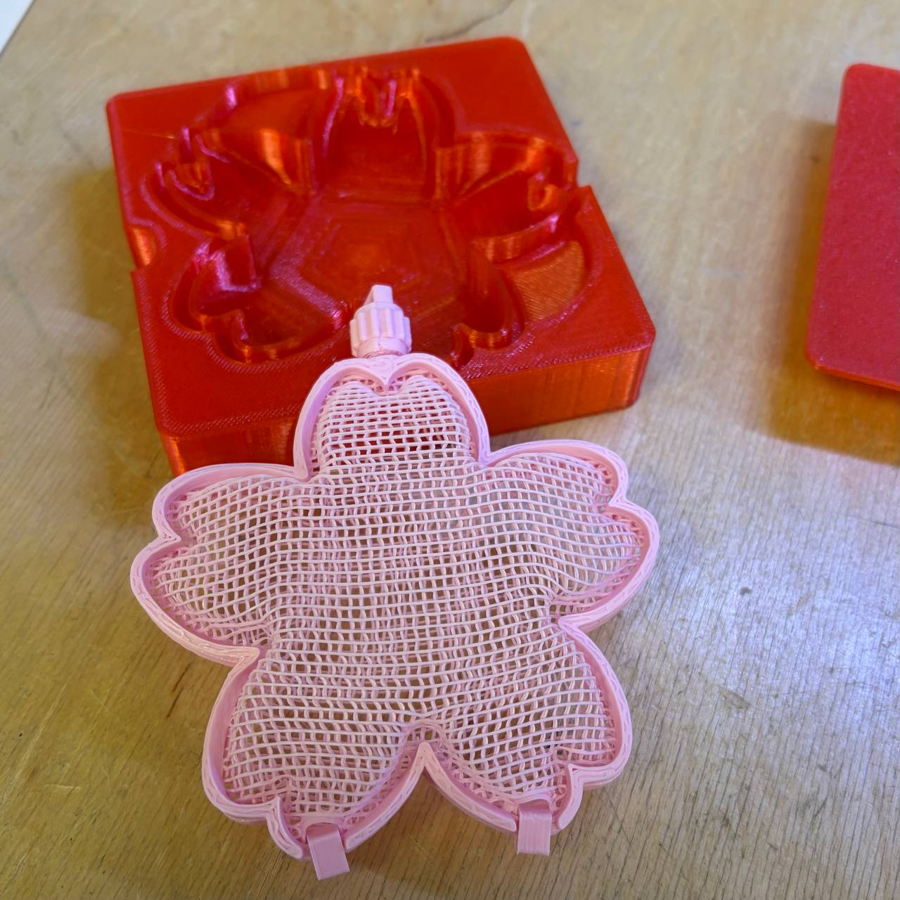
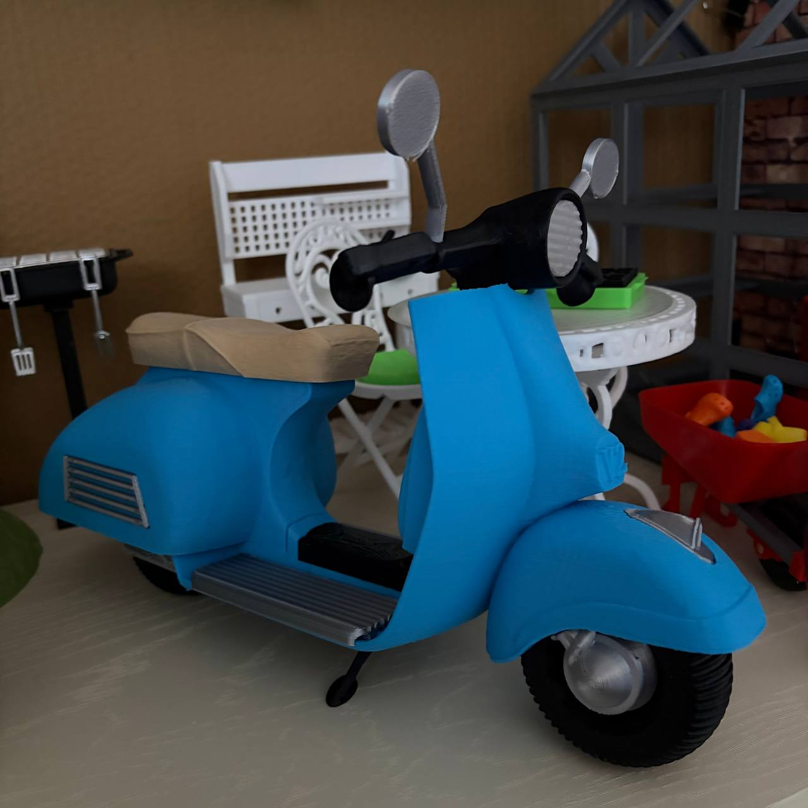
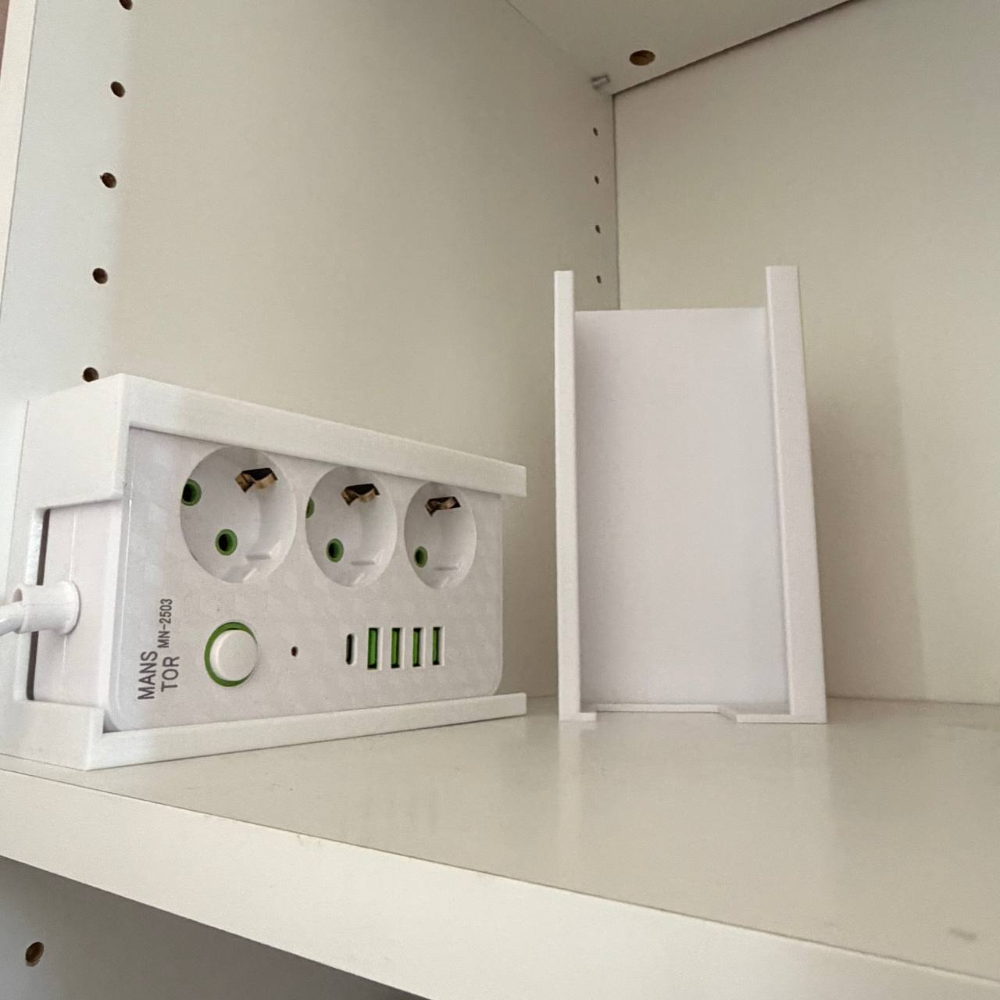

# CoLab
 
Яндекс подружился с Университетом науки и технологий МИСИС и нам выпал отличный шанс походить в фанлабу поучиться полезному и поделать прекрасное (или не очень - как получится). 
Обстановка там очень творческая, а мастера всегда готовы рассказать много полезного и подсказать что и как лучше сделать. 
   
  

# 28 июня
<b><a href = "./crocs/README.md">Мини кроксы</a></b> 
  
  
<b><a href = "./thermoformed_sakura_flowers/README.md">Термоформованная коробочка-сакура</a></b> 
  
 

# 3 и 18 июля
<b><a href = "./mini_vintage_scooter/README.md">Винтажный мини скутер</a></b> 
  
 

# 19 июля
<b><a href = "./power_strip_mount/README.md">Крепление для сетевого фильтра</a></b> 
  

--
 
<a href = "./vattenkar_trays/README.md">Вставки для полки Ikea Vattenkar </a>
 
<a href = "./needle_file_holder/README.md">Держатель для надфилей</a>
 
<a href = "./bts_clip/README.md">Закладка для книг в виде скрепки</a>
