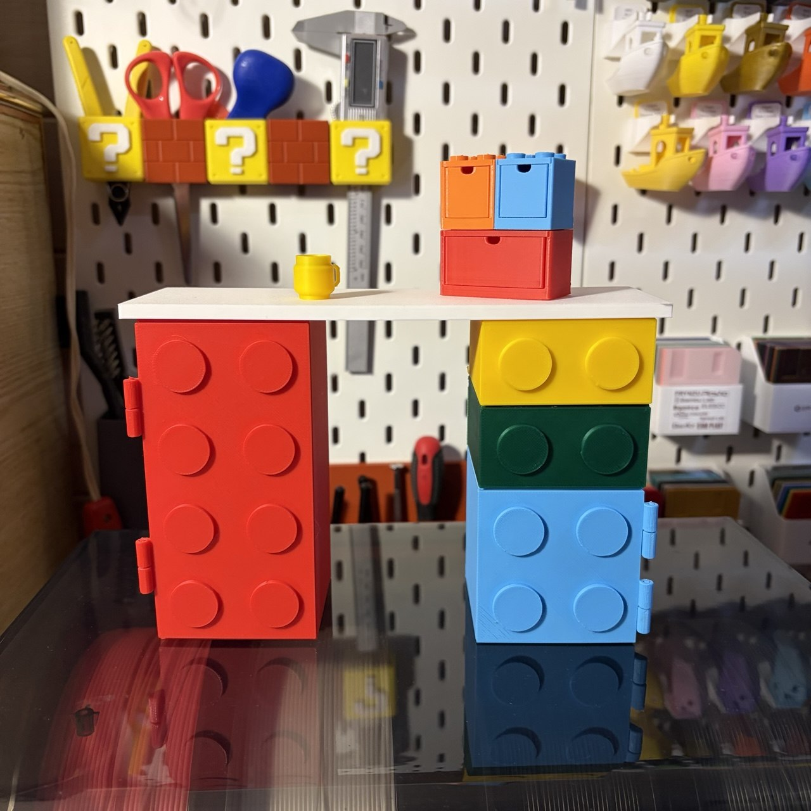
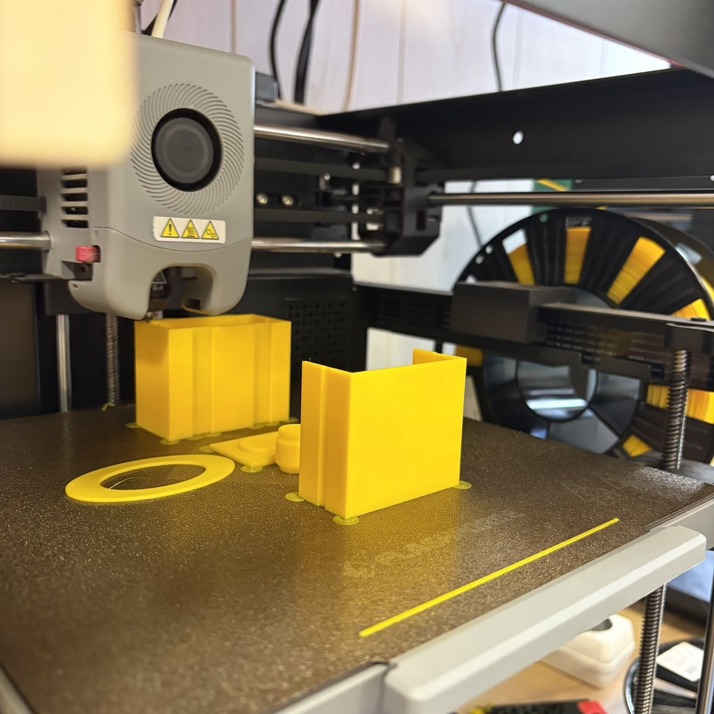
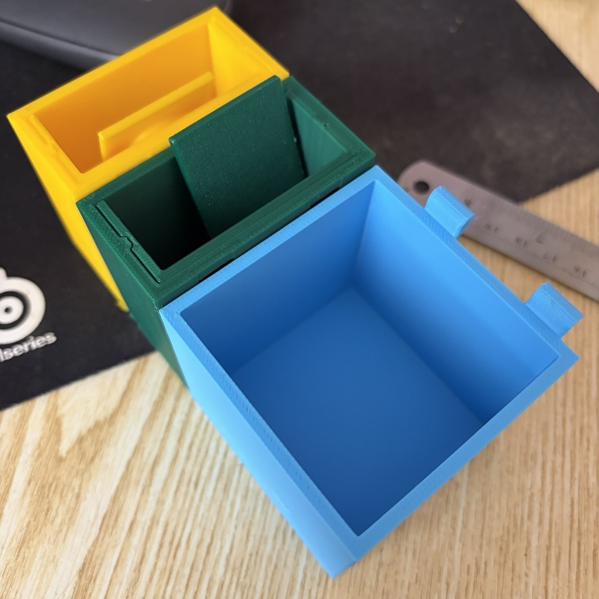
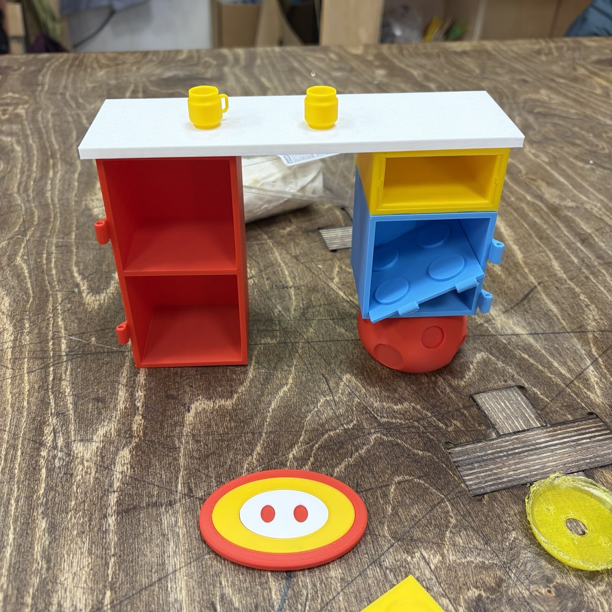
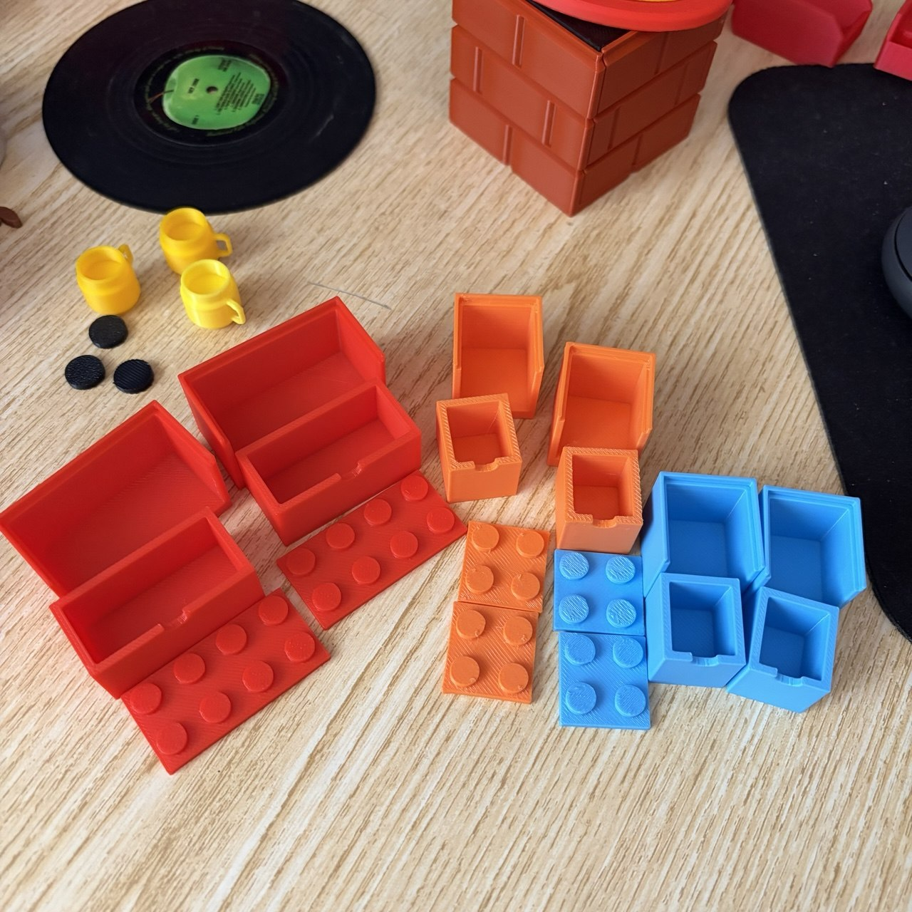
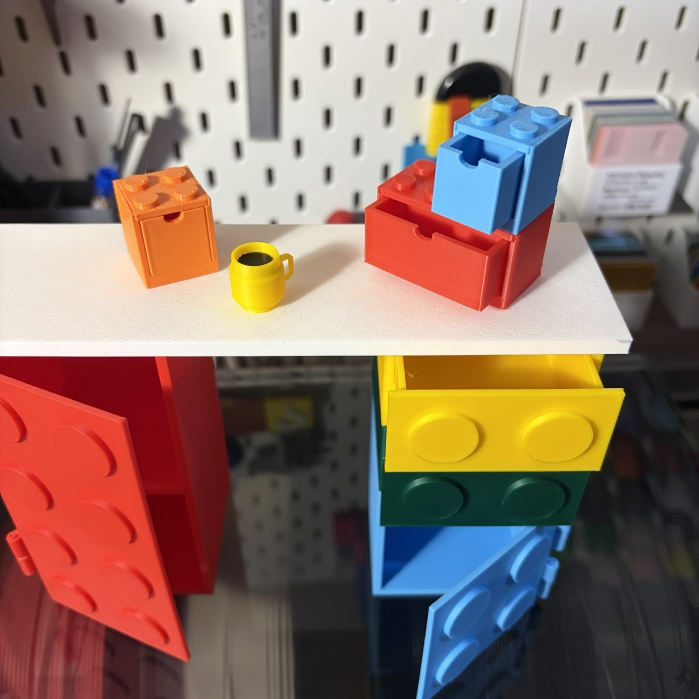
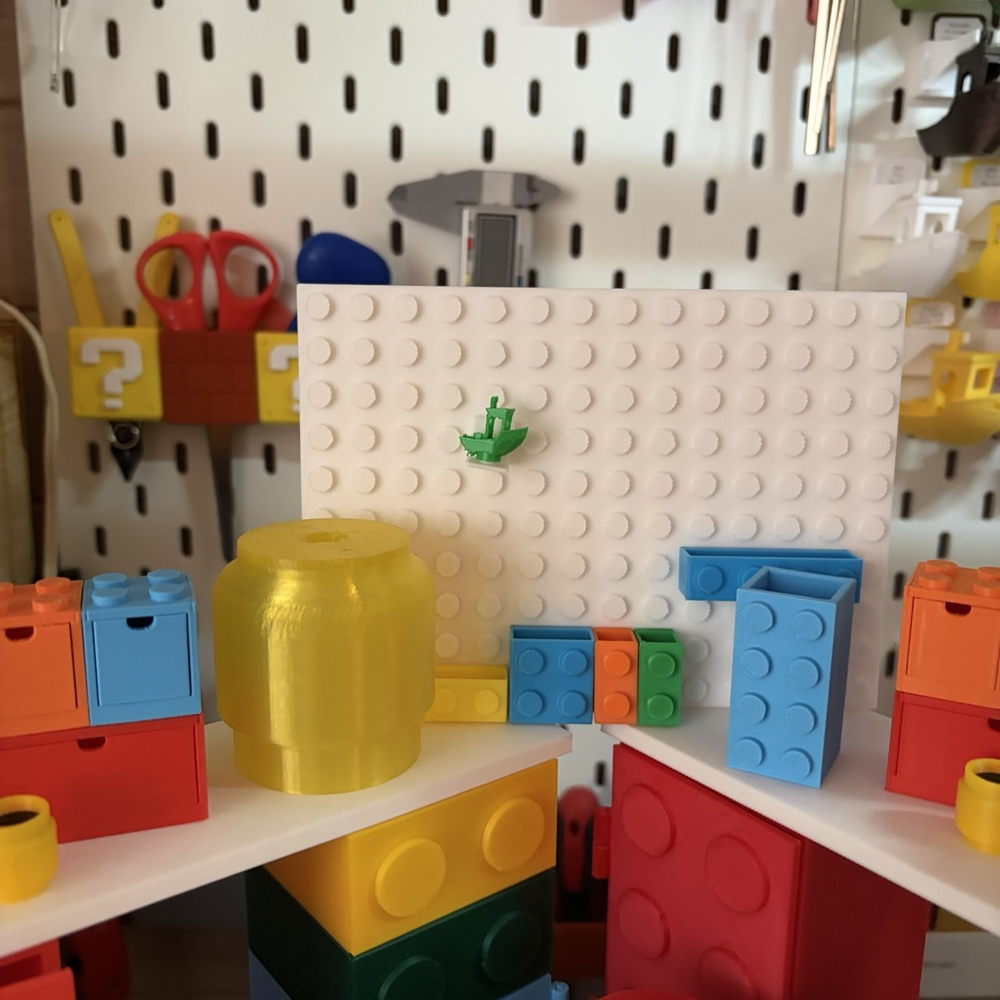
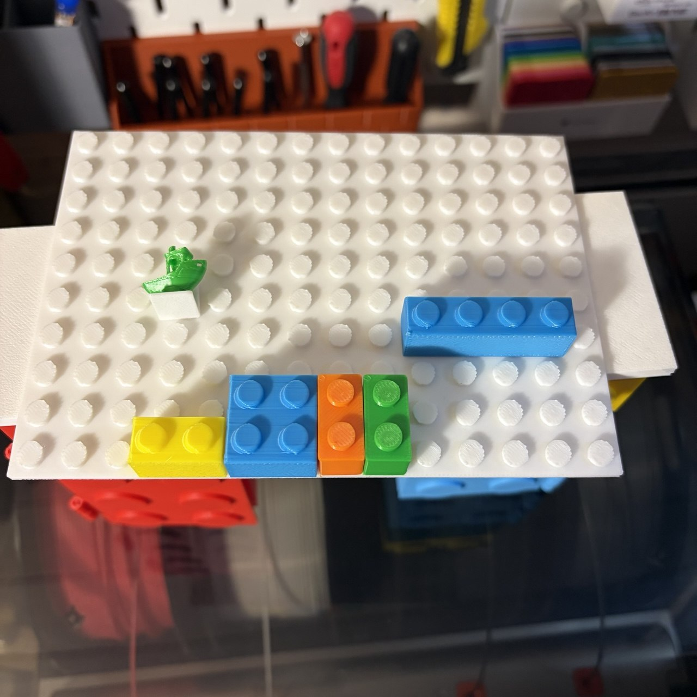
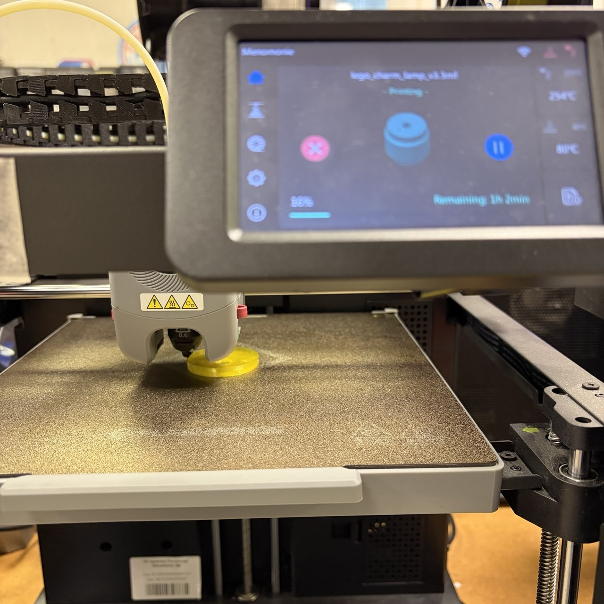
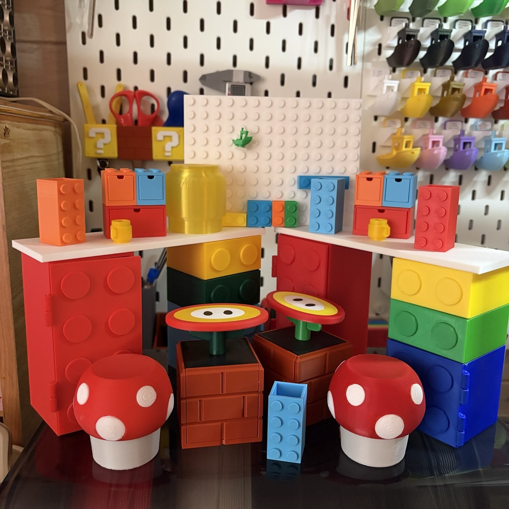

Ну а где пазлы и тетрис, там и лего. 
Сделала мини-стол в стиле лего (референс нашла на pinterest), все детали (ящики, дверки, вставки в ящик, столешница) печатаются отдельно в нужных цветах, а дальше собираются по направляющим. Отдельный челендж был придумать петли, в Лабе все активно помогали советами, в итоге выбрала вариант, когда в качестве стержня в петлю вставляется просто кусок обычного филамента. А вот на крепление вставки в ящик к фасаду ящика меня уже не хватило после петель, решила, что дихлорметан мое все)) 
Ну и за компанию сделала кружку в виде головы лего-человечка, плафон для люстры, коробочки, пегборд с навесами. Все модели лежат <a href = "./models">тут</a>. 
А еще на фото можно увидеть спойлер следующей игровой темы для мини-интерьера))) 
 
 
 
 
 
 
 
 
 
 
