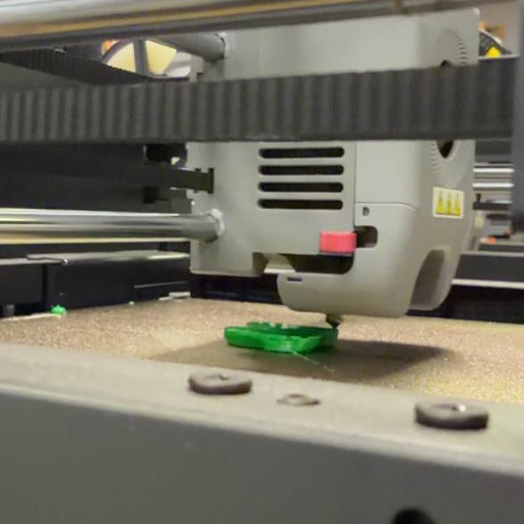
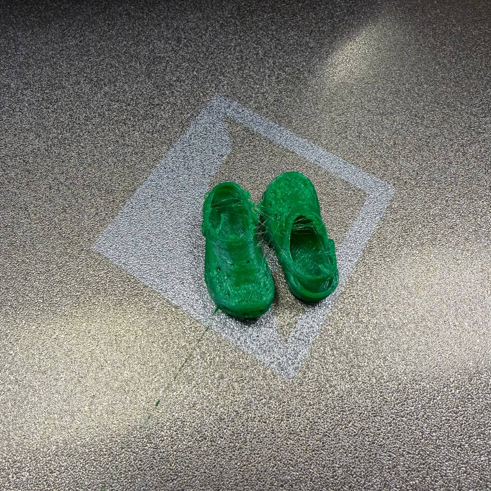
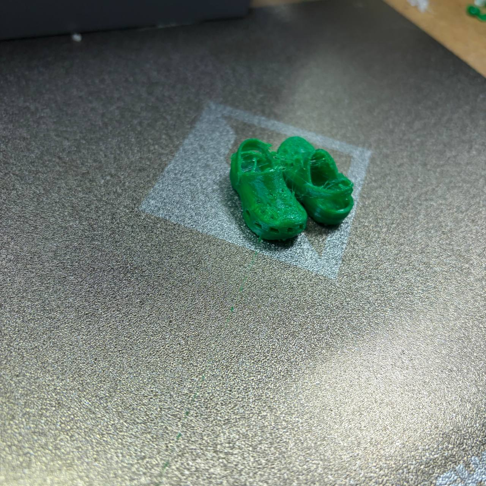

В Лабу первый раз я попала 28 июля. Пришла, так сказать, на разведку и с желанием попечатать из TPU, потому что увидела его в списке доступных материалов, а сама из него никогда не печатала. 
Первое, что получилось напечатать - это мини кроксы. Так я поняла, что печатать мелкое из TPU - не очень хорошая идея. Но опыт - это именно то, за чем я туда шла. 
   
  
