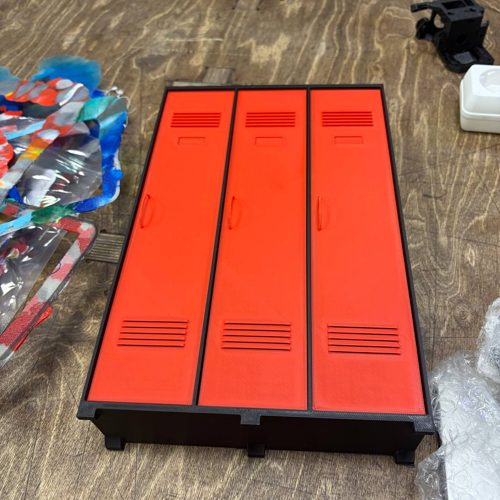

Реанимировала давний проект мини-гаража, решила сделать для него локер, готовое нашла только в форматах 1:12 и 1:18, но при увеличении до 1:6 толщина стенок становилась очень приличная, выглядело не особо красиво и печаталось долго. Решила попробовать сделать свое. Сам шкаф (<a href = "./locker_main.stl">stl</a>, <a href = "./locker_main.stp">stp</a>), дверка (<a href = "./locker-door.stl">stl</a>, <a href = "./locker_door.stp">stp</a>).  
 
Вот такая красота получилась 
 

