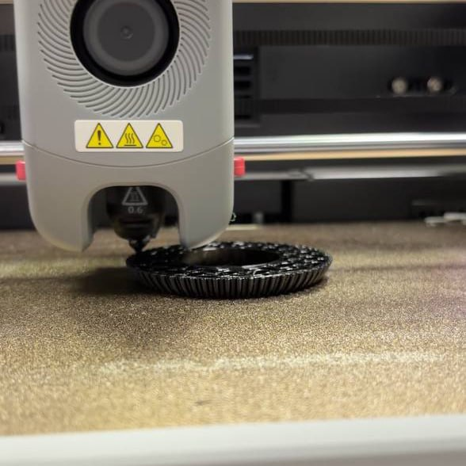
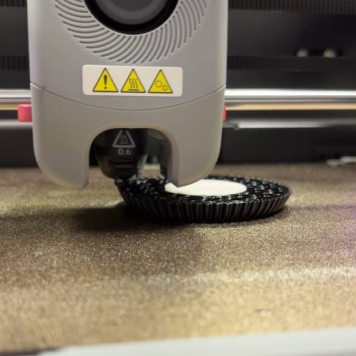
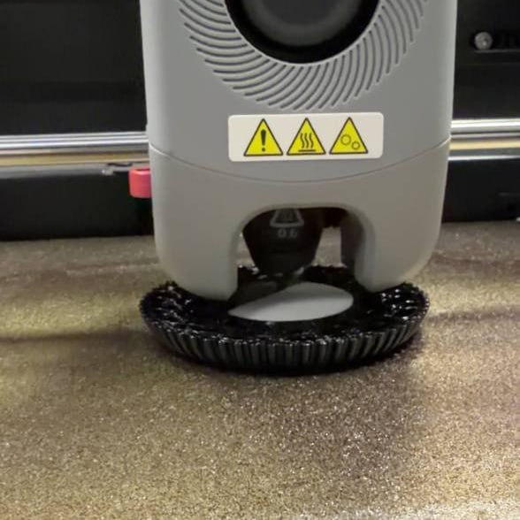
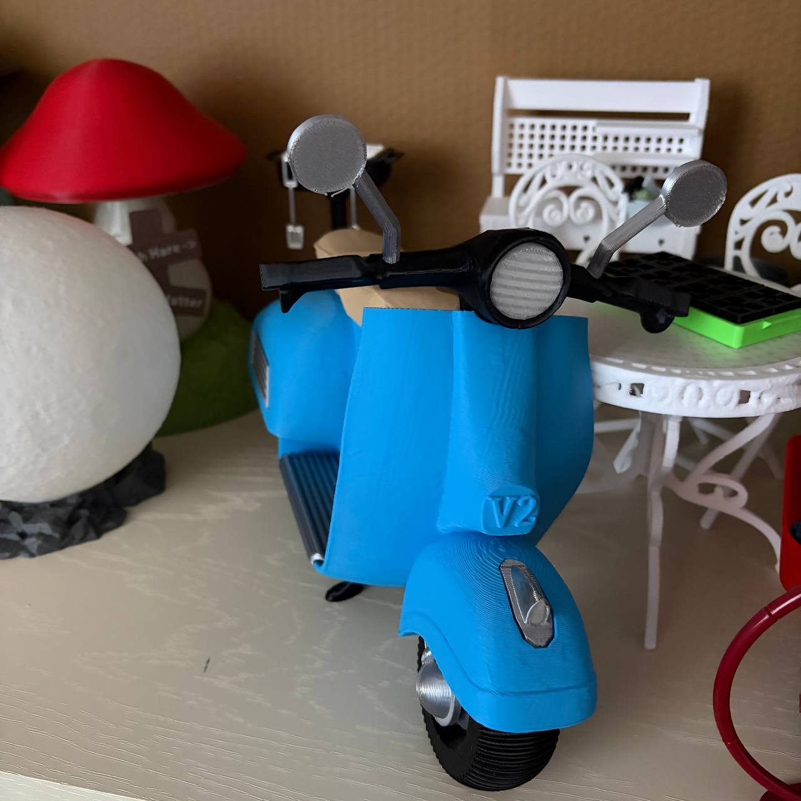

На следующее занятие я пришла изобретать колесо))) А если серьезно - давно хотела напечатать миниатюрный скутер, но прогноз по общему времени печати всех деталей был очень грустный, и скутер съезжал в очереди все дальше и дальше. Но теперь появилась возможность напечатать колеса из TPU, оно вроде и не за чем, но круто же. Вот только жестокая реальность предъявила мне, что: 
- печататься колеса будут очень долго 
- для печати необходима поддержка, а еще на прошлом занятии я узнала, что лучше не печатать из TPU с поддержками 

На помощь пришли местные мастера: 
- сопло заменили на 0,6 
- напечатали поддежку из PLA или PETG (этот момент я пропустила), благо она была простой геометрической формы 
- потюнили настройки 

И вот колесо печаталось уже полтора часа и не требовало поддержек, надо было подложить уже готовую.  
Печатаем 
 
 
Подкладываем готовую поддержку 
  
 
Остальные детали я печатала дома, печатала "на всех порах", если не присматриваться, то вроде даже и ничего. 
 
