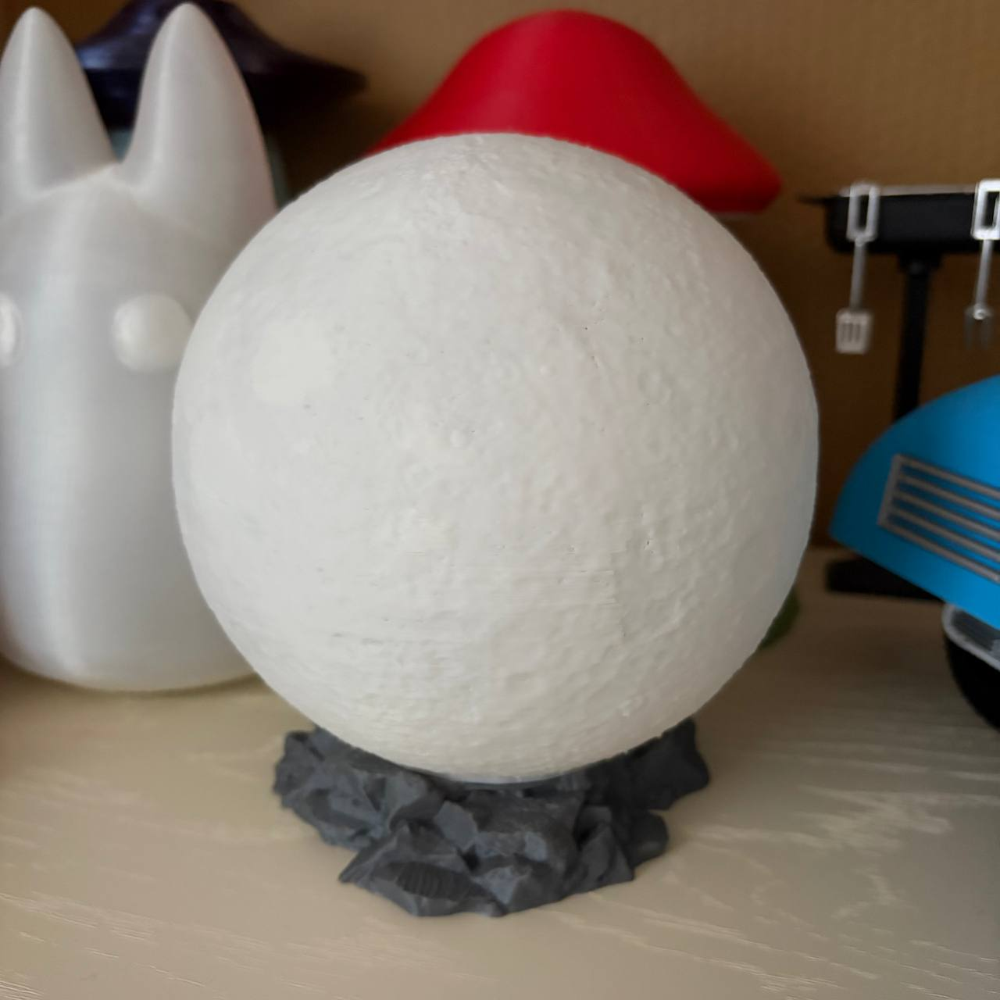

Я люблю лампы, поэтому у меня <s>нечего надеть и слишком маленький шкаф</s> очень много напечатанных ламп и мне некуда их ставить. Порой приходится коварно от них избавляться - когда кто-то говорит "Какая красивая лампа" - это уже его лампа. 
Луну печатать дома я опасалась, потому что, во-первых, долго, во-вторых у нее был большой шанс слететь с <s>орбиты</s> платформы при печати. 
Решила рискнуть напечатать в Лабе, мастера помогли подобрать настройки (там переменная высота слоев, я про такое до этого не слышала) и вуаля. Рядом можете наблюдать еще одну лампу - чиби-Тоторо, сзади видно шляпку лампы-гриба, а совсем в углу притаилась лампа-НЛО. 
 
