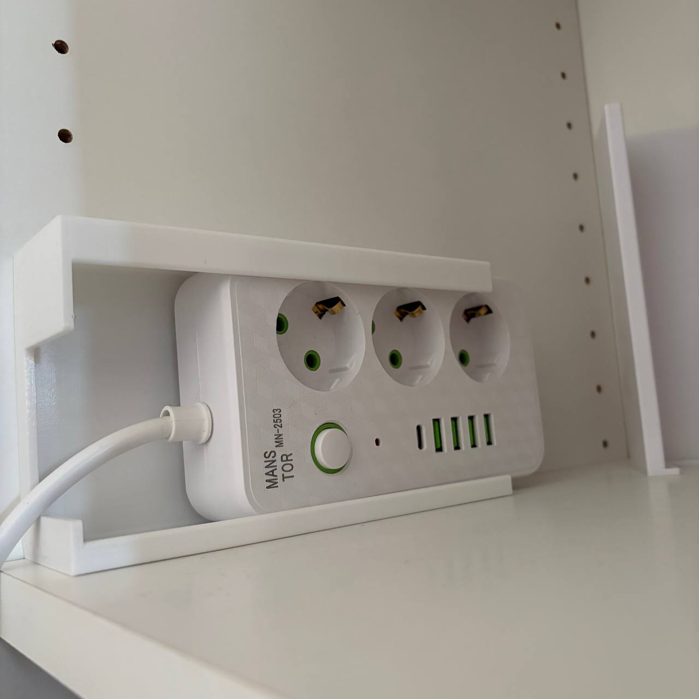
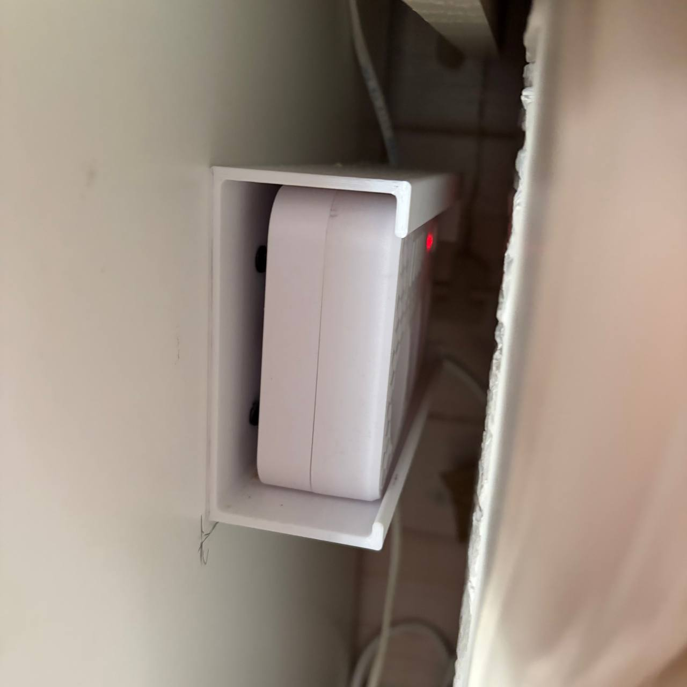
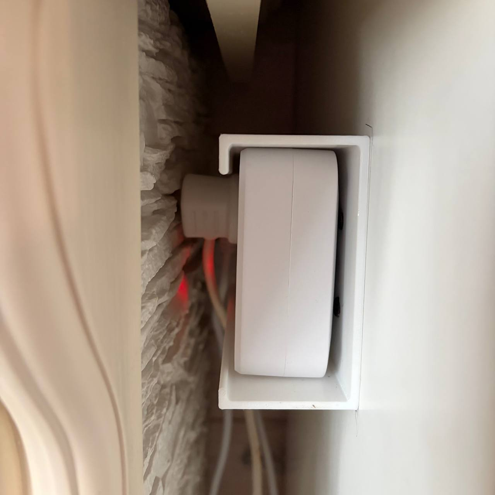

Крепление для сетевого фильтра на боковинку шкафа.
 
Нужно было закрепить сетевые фильтры в очень узком пространстве между двумя вертикальными поверхностями, чтобы можно было при необходимости включать/выключать устройства. Такое крепление позволит выдвинуть фильтр, отключить/подключить нужное и задвинуть обратно.
 
Крепления зеркальные (лицом друг к другу), поэтому выкладываю только одну модель (<a href = "./power_strip_mount.stl">stl</a>, <a href = "./power_strip_mount.stp">stp</a>)
 
Фото просто на полке, потому что в месте крепления их почти не видно (как и задумывалось по сценарию).
 
 
 
И фото в местах установки
 
 
