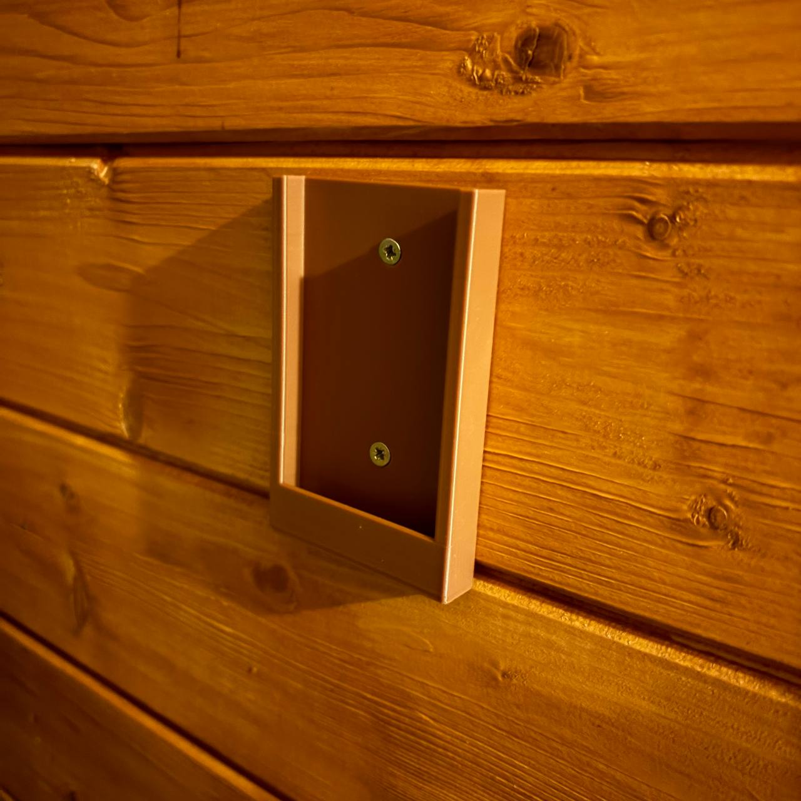
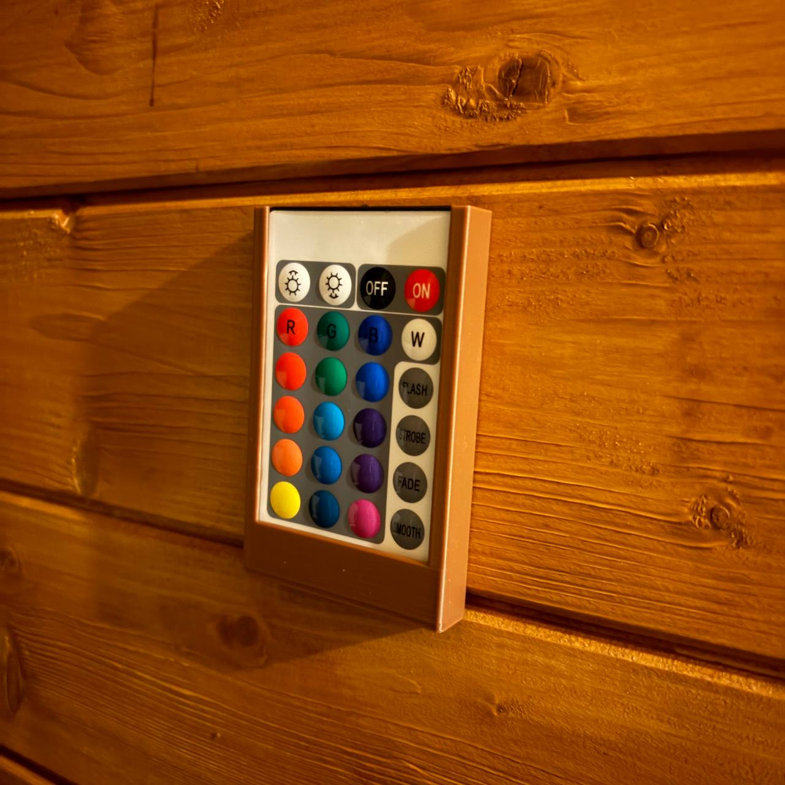
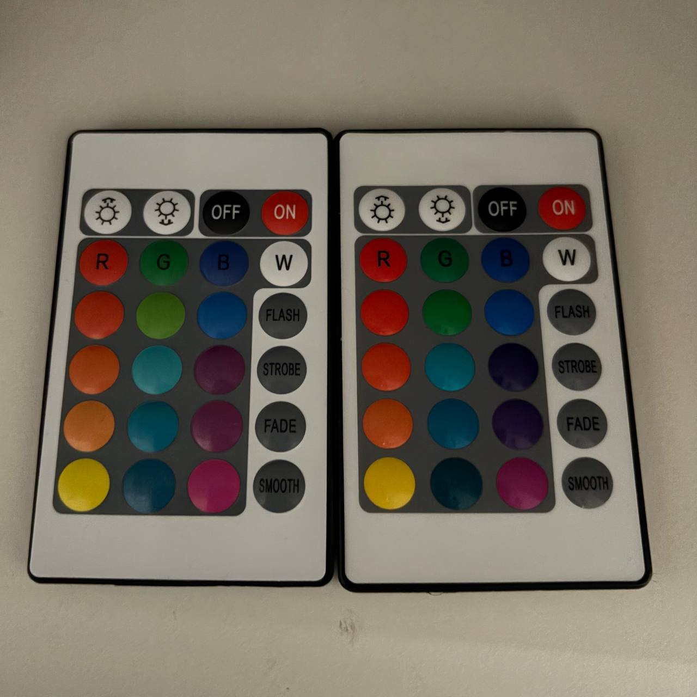
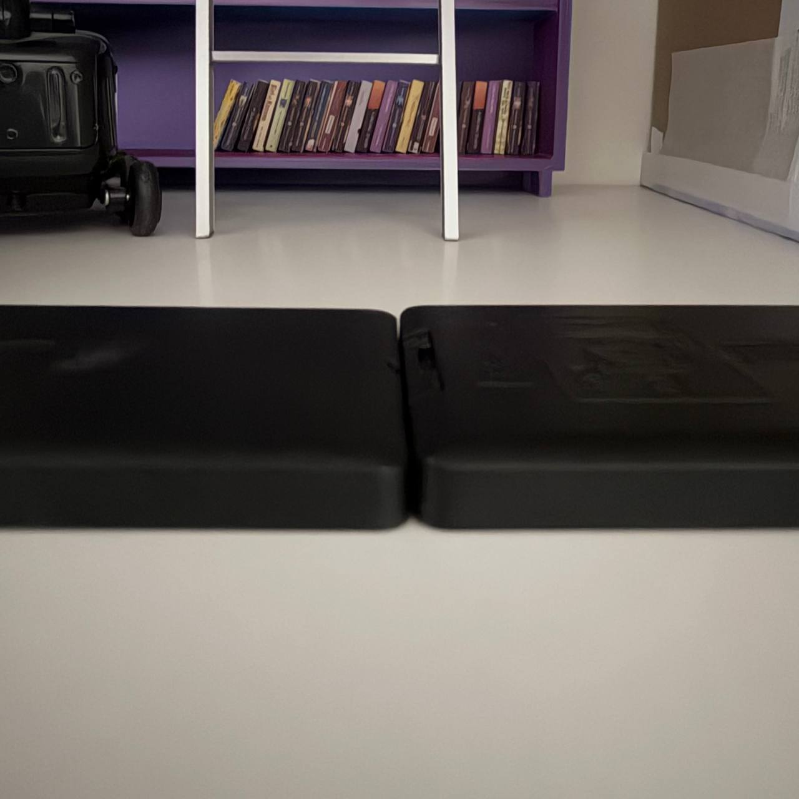
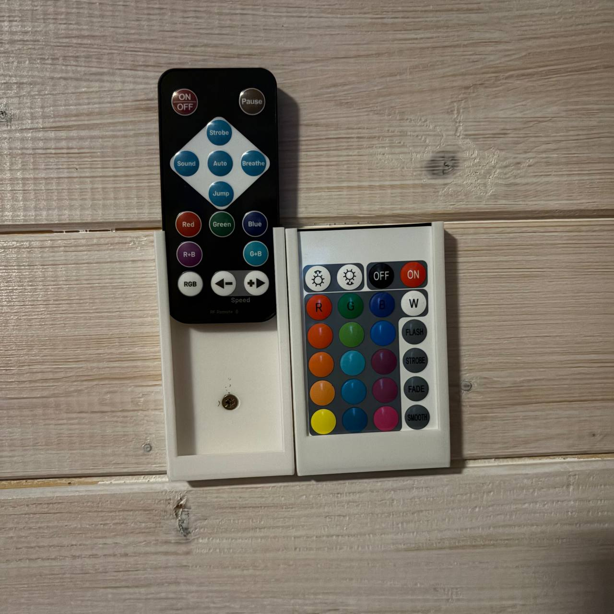

Каждому, наверное, приходилось искать пульт от чего-то, а когда пультов много и они еще похожи друг на друга, разобраться и найти становится совсем тяжко. Вот и решила я потихоньку делать держатели для пультов и вешать их рядом с управляемыми устройствами. 
 
Крепление для пульта 51х84х7 (<a href = "./remote_holder_1.stl">stl</a>, <a href = "./remote_holder_1.stp">stp</a>) 
  
 К моему удивлению, два пульта, которые на вид и два измерения (высота и ширина) были абсолютно одинаковым, оказались все же разными по толщине и тот, что потолще, заходит в крепление с усилием и его неудобно доставать.
  
 
И еще одно крепление для пульта 40х86х7,5 (<a href = "./remote_holder_2.stl">stl</a>, <a href = "./remote_holder_2.stp">stp</a>), вот тут оба крепления висят рядом. 
  
