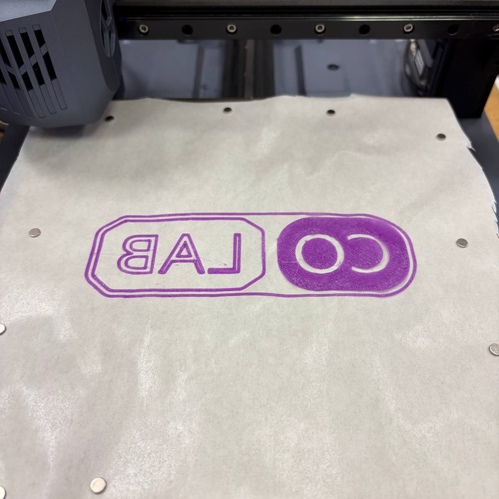
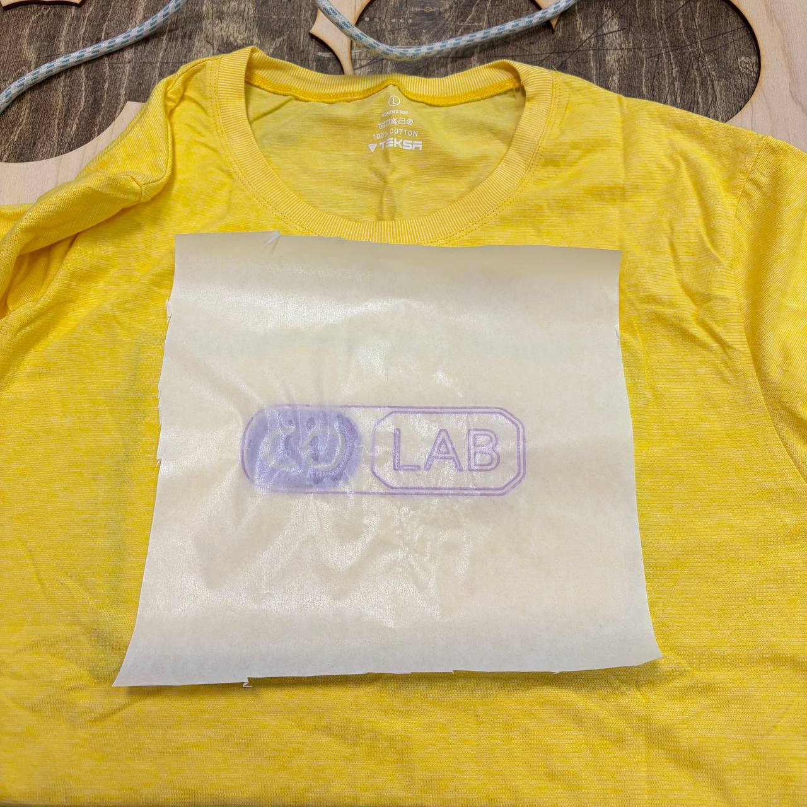
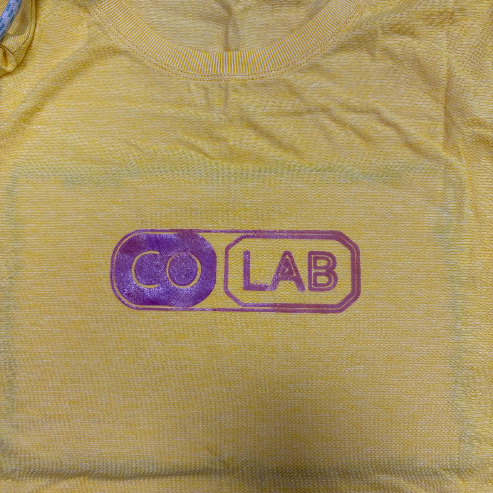
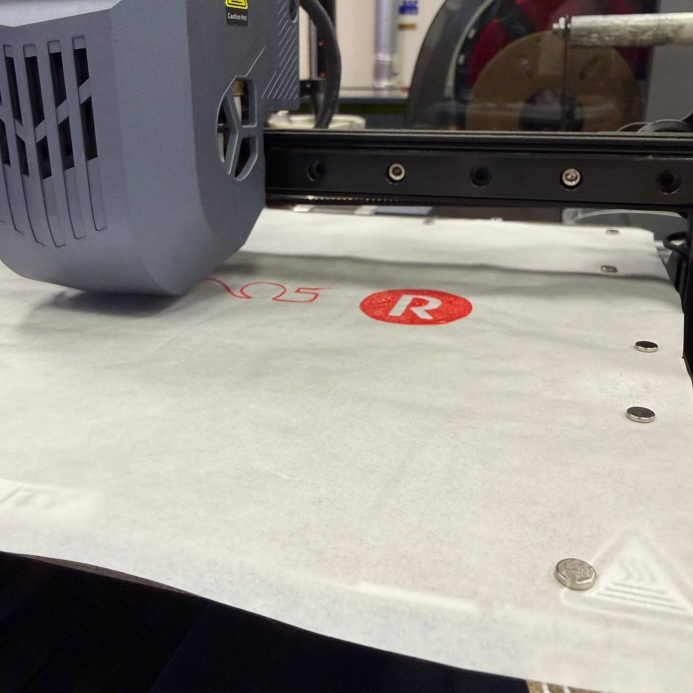
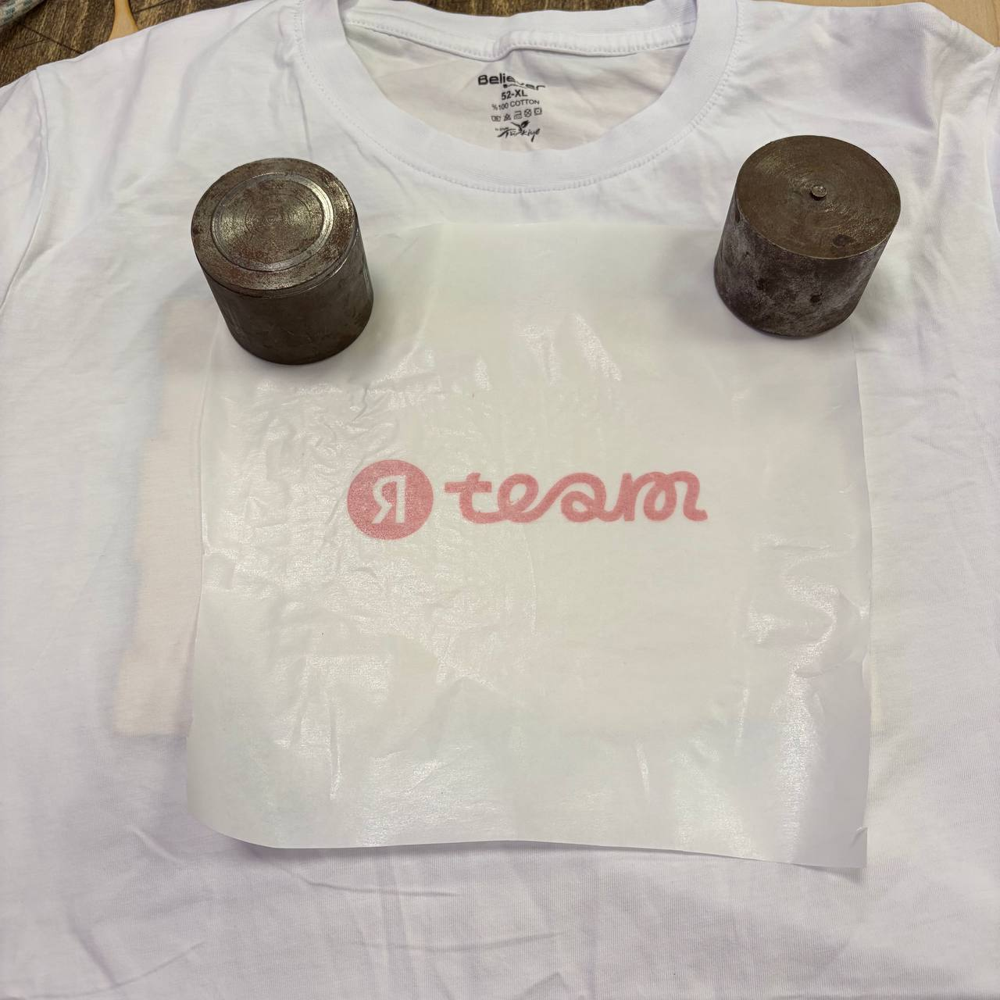
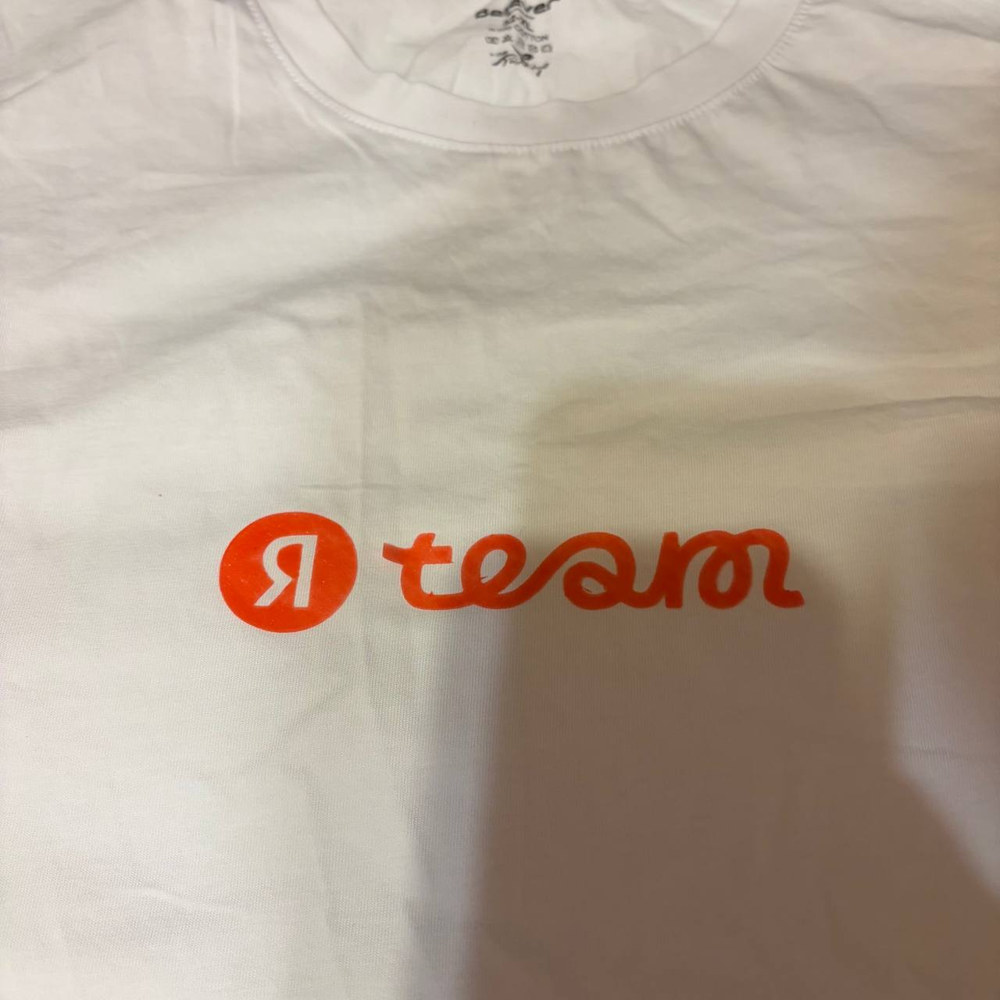
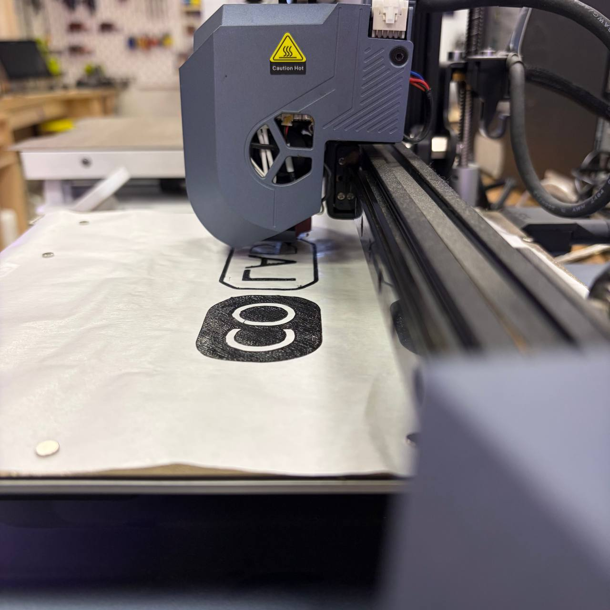
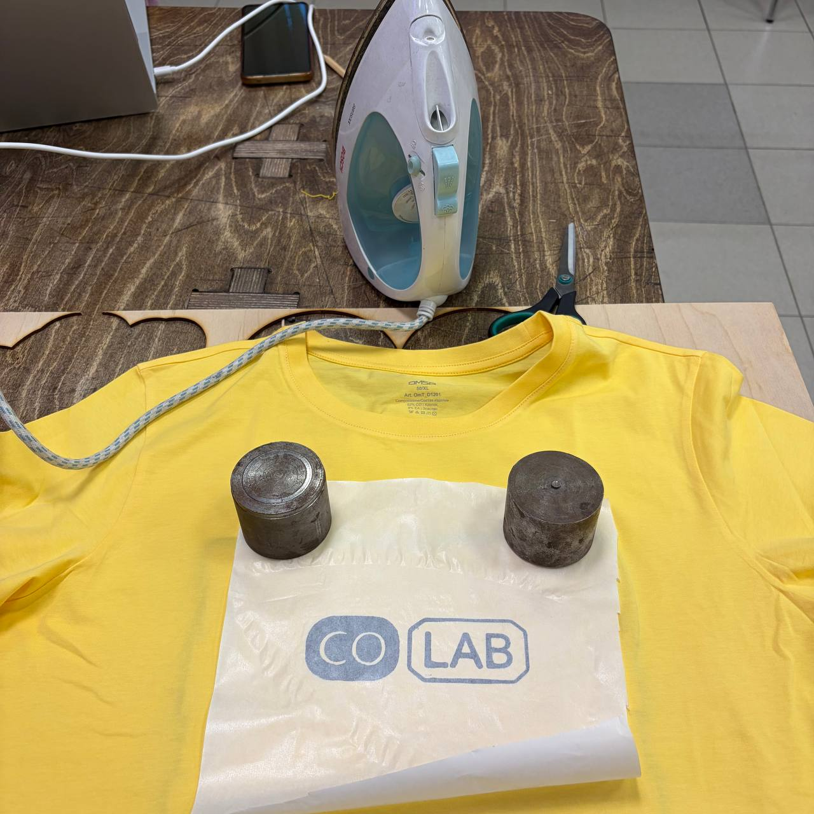
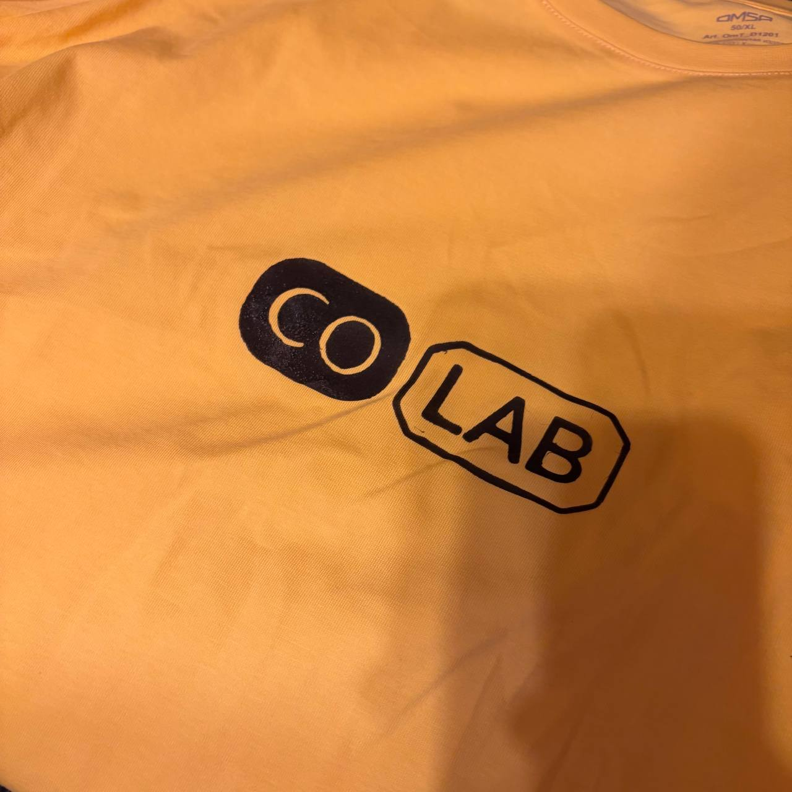

На просторах интернета увидела, что можно из TPU напечатать термопереводную наклейку на ткань. Купила самые простые футболки и фиолетовый светящийся в темноте (еще не проверяла) TPU, взяла пергамент для выпечки и поехала в Лабу. 
Первый день прошел в попытках распечатать первую наклейку. Было решено печатать прямо на пергаменте, хотя ии говорил, что делать этого не стоит, так как TPU будет стягивать пергамент. В целом, не сказать, что ии был не прав, бумагу действительно стянуло немного, но линии у логотипа тонкие, печать состоит из нескольких деталей, часть из которых очень мелкие - разложить все ровно и закрепить на ткани проблематично, поэтому решили попробовать. Из опыта - на пергамент нужен клей, две попытки напечатать без клея привели к тому, что пластик не прилип к пергаменту, с клеем таких проблем не возникало. 
Сначала тупили мы, потом тупил принтер. В итоге к концу занятия наклейка была напечатана. 
Второй день начался с перевода на ткань - процесс вроде бы не сложный, хотя переводная деталь немного поплыла - может перегрела, может деталь для перевода была слишком толстая, может рука дернулась (двигать утюг в процессе трансфера категорически нельзя). Но все равно это успешный успех.  
 
 
 
 
Дальше уже по накатанной, но в 1 слой был напечатан и переведен логотип команды Яндекса. 
 
 
 
 
Ну и поскольку время еще осталось, а затевать что-то новое смысла не было, еще один лого Колабы. 
 
 
 
 
Как оно будет стираться и носиться - покажет время. Выкладывать сами лого не буду - мало ли. 
