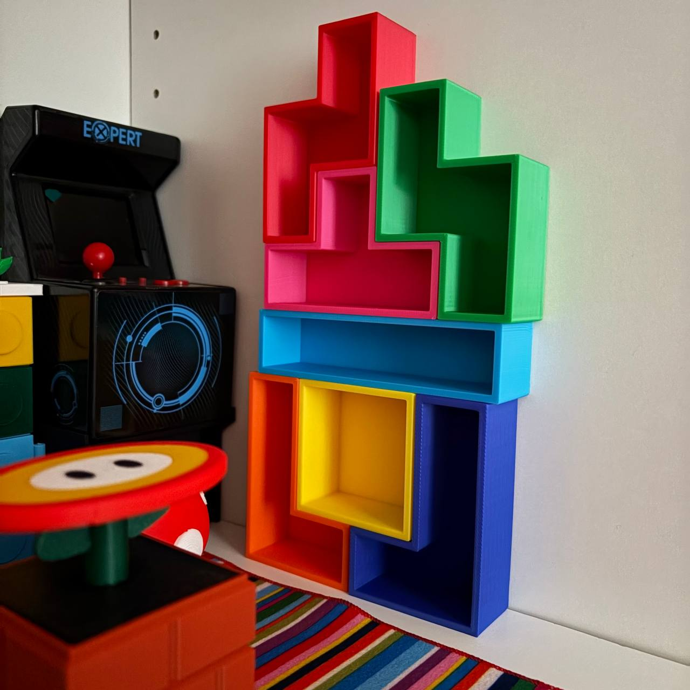
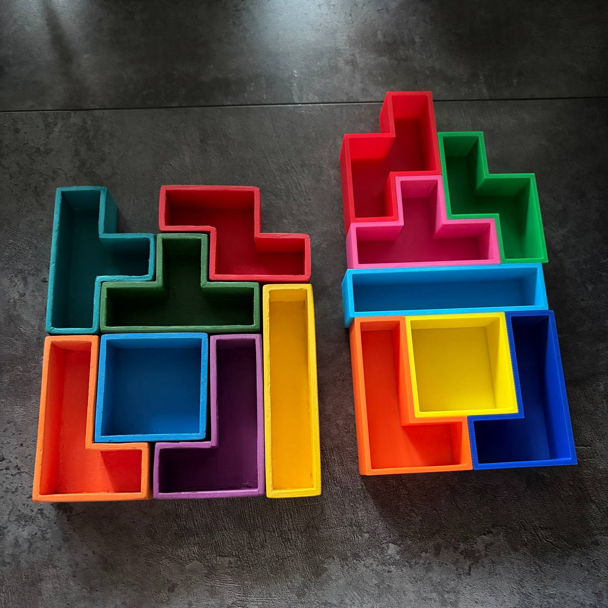

На табуреткотоне сделали табуретку из кусочков пазла, и вспомнилось мне, что когда-то у меня был мини-стеллаж в виде фигур тетриса. Сделан он был из фанеры, но был неудачно покрашен какой-то странной незасыхающей краской, после чего кое-как ободран и покрашен еще раз, но в результате стал выглядеть немного покоцанным. 
Ну что-что, а которобки делать мы теперь умеем, поэтому напечатала новый на 3d принтере. 
 
Старый vs новый. 

