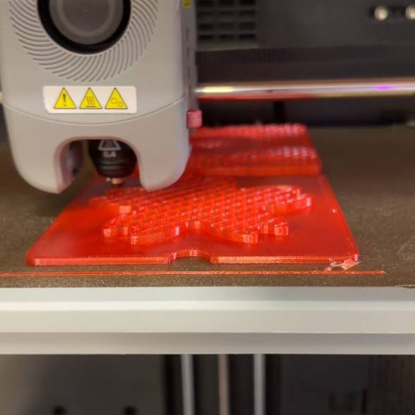
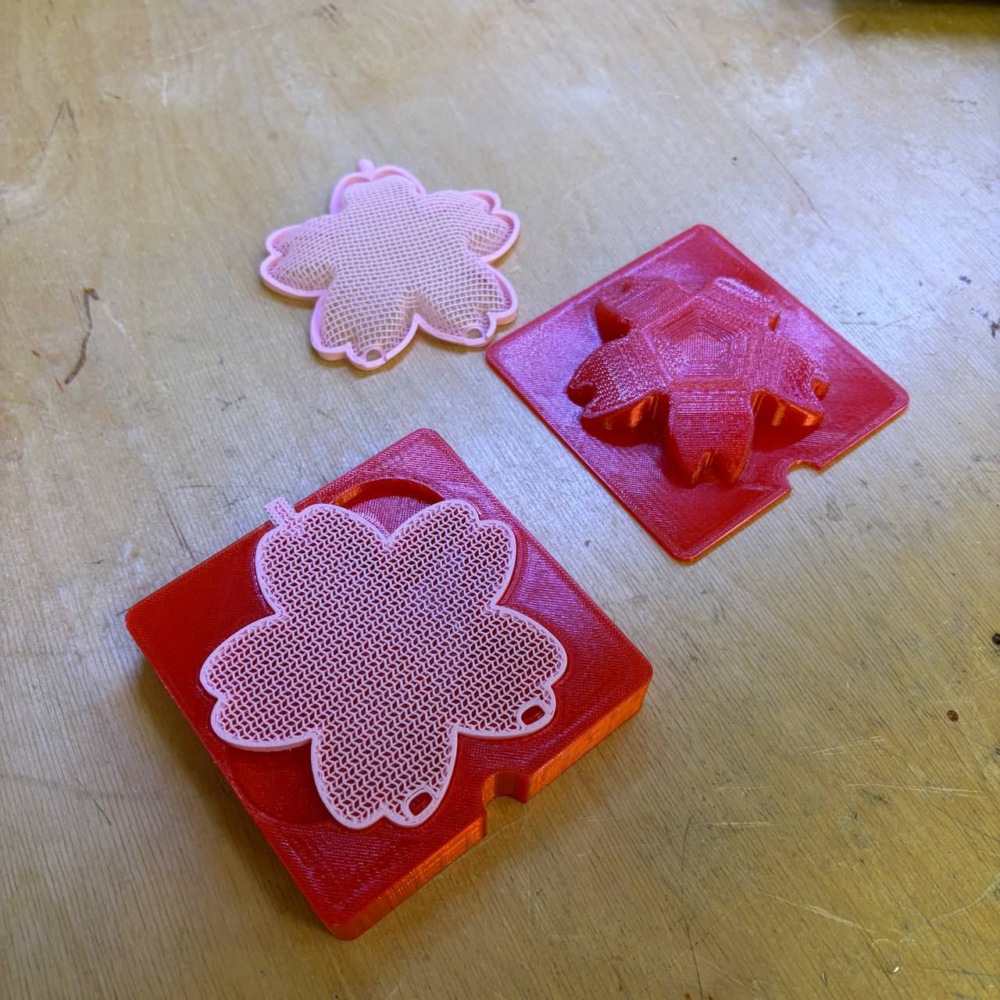
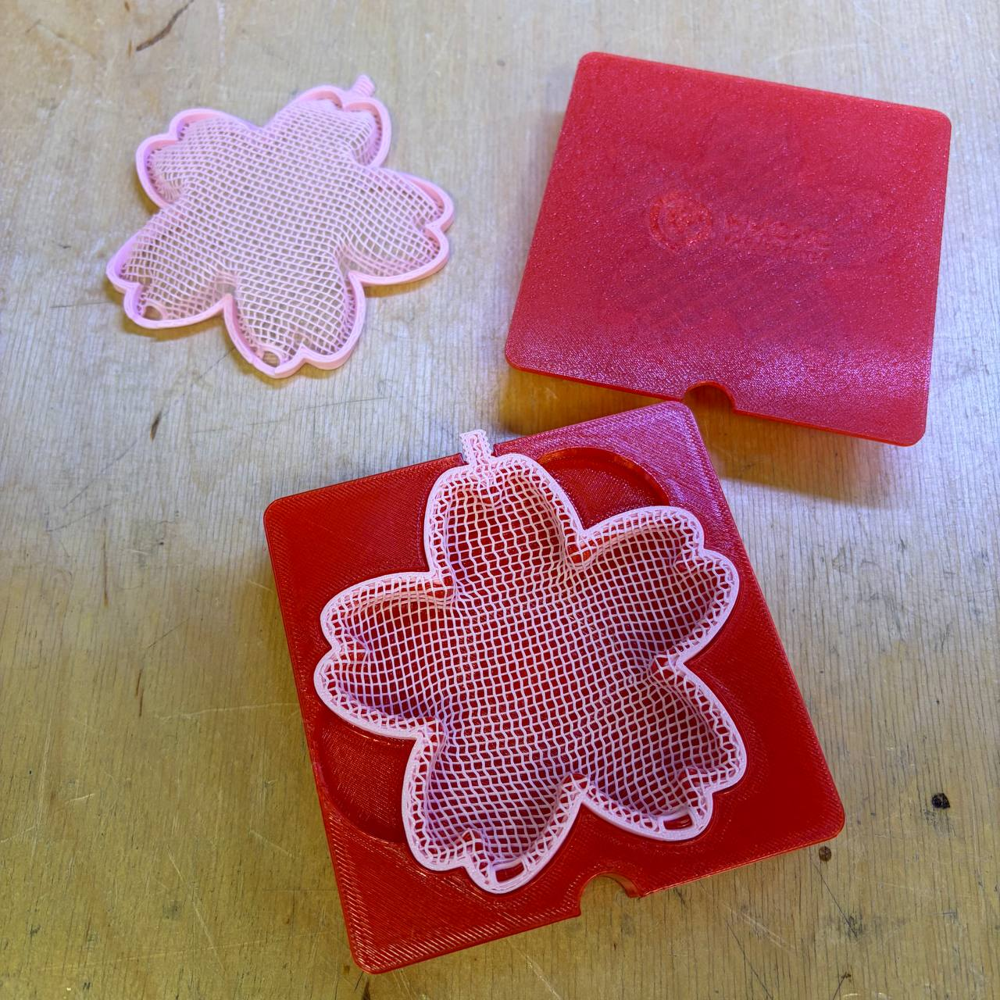
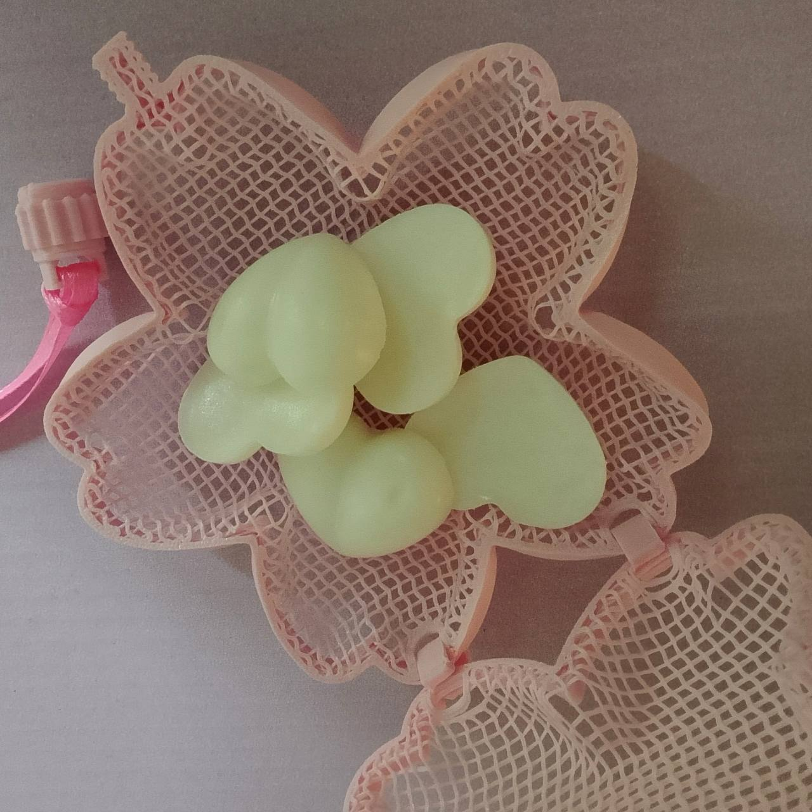
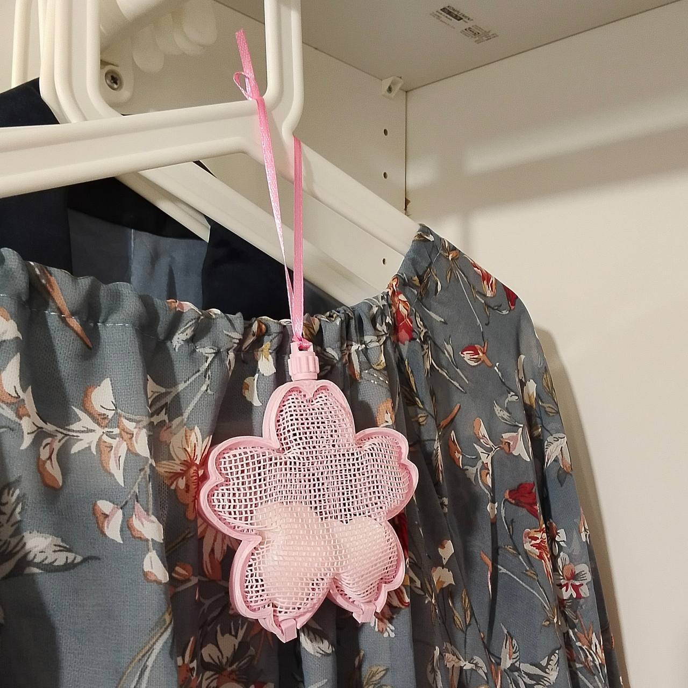

Термоформованную сакуру хотела напечатать давно. Суть в том, что молд печатается из PETG, а сами заготовки из PLA без верхних и нижних слоев (только заполнение). Заготовку накладывают на нижний молд и нагревают феном (обычным для волос, чтобы размягчилась только заготовка, а молд остался твердым), быстро вдавливают верхнем молдом и дают остыть. 
PETG у меня на тот момент не было вообще, поэтому печатала молд в Лабе. Молды печатала дома с двумя видами заполнения - гироид и соты. 
 
 
Накладываем и нагреваем феном 
 
 
Вдавленная половинка 
 
 
Готово 
 
 
С первого раза у меня не получилось продавить заготовку полностью, при ее повторном нагревании феном она опять стала плоской и отлично продавилась.
В итоге получается коробочка, куда можно положить, например, аромо-саше, и повесить в шкаф. Да мало ли как можно такую красоту использовать. 
  
