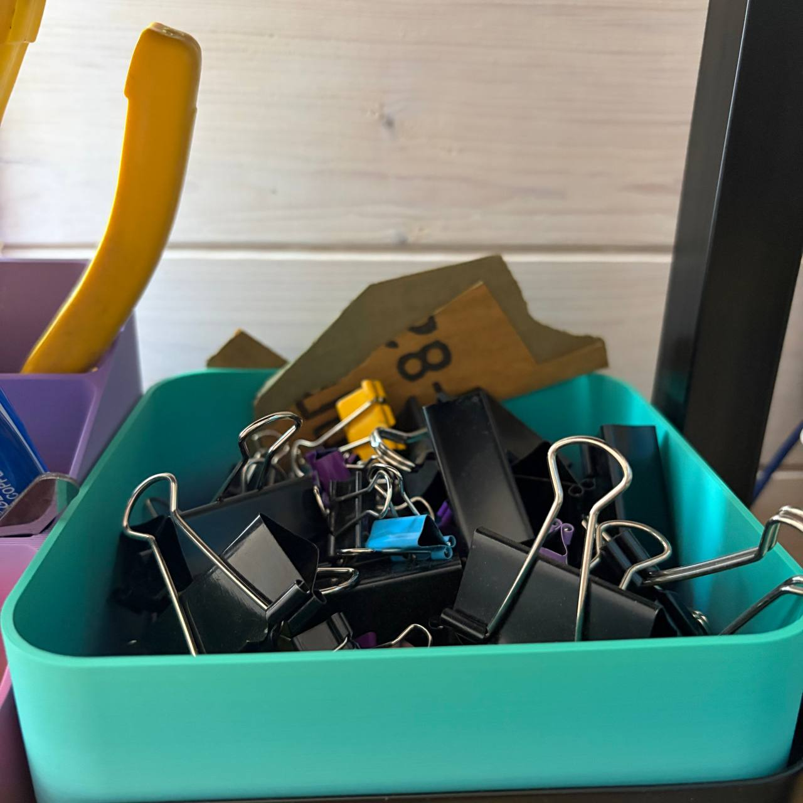
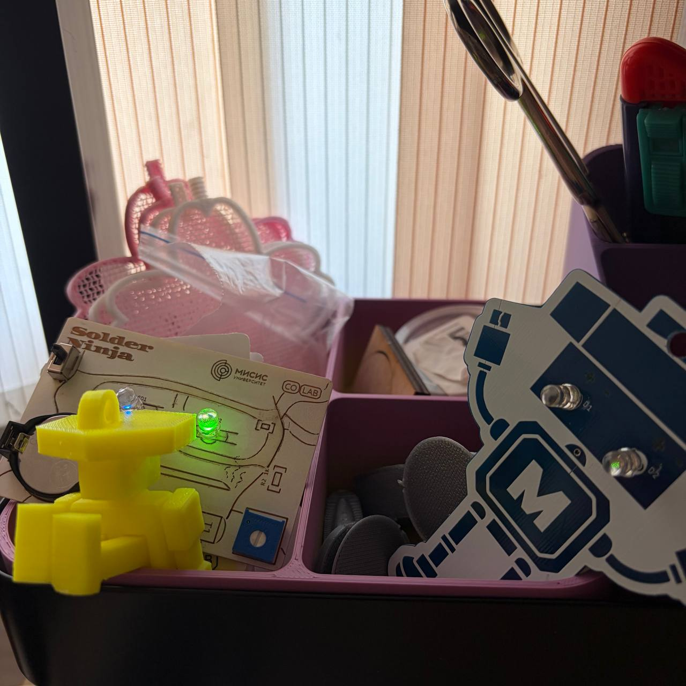
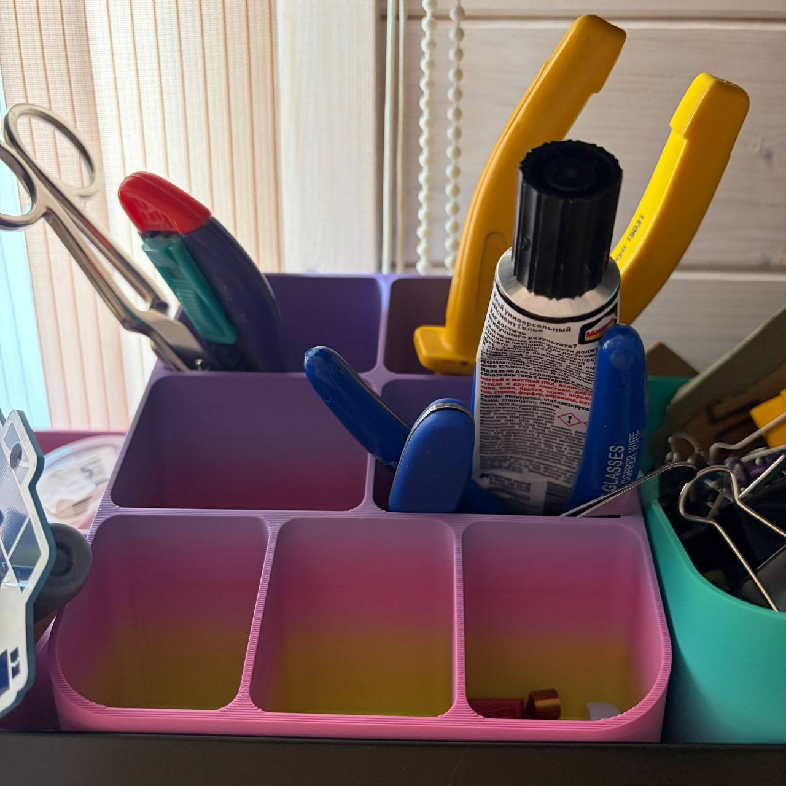

Вставки для полки Ikea Vattenkar (605.415.71)
 
Вставки моделировались с учетом того, что полки прикручены к кронштейнам за дальние крепления:
 
- вставка с одним большим делением - предполагается размещение справа (<a href = "./vattenkar_tray_x1.stl">stl</a>, <a href = "./vattenkar_tray_x1.stp">stp</a>)
   
  
   
- вставка с четырьмя делениями - предполагается размещение слева (<a href = "./vattenkar_tray_x4.stl">stl</a>, <a href = "./vattenkar_tray_x4.stp">stp</a>)
   
  
   
- вставка для канцелярии с 8 делениями разной высоты - предполагается размещение в центре (<a href = "./vattenkar_tray_x8.stl">stl</a>, <a href = "./vattenkar_tray_x8.stp">stp</a>)
   
  
   

Вот такая красота
 

